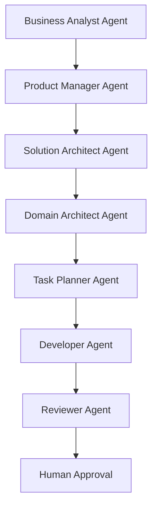
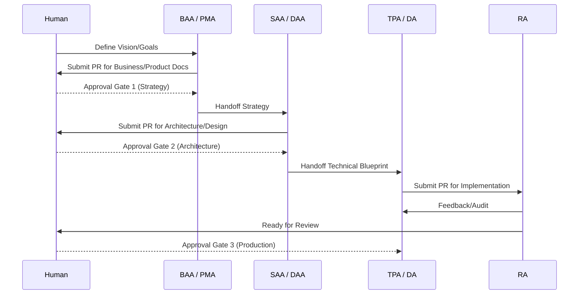

# Agent Workflows & Communication

## Agent Dependency Diagram
Each agent relies on the approved output of its predecessor in the SDLC.

## Sequential SDLC Workflow
The workflow follows a linear progression with feedback loops only allowed within phases or back to the immediate predecessor.

## Approval Gate Workflow
No phase transition may occur without a "Green Light" from the respective Human gatekeeper.

| Gate | Name | Gatekeeper | Requirement |
|------|------|------------|-------------|
| 1 | Strategy Sign-off | Business Owner | All business flows and user stories are prioritized and meet commercial goals. |
| 2 | Architecture Sign-off | Lead Architect | High-level system design and data models are scalable and secure. |
| 3 | Implementation Sign-off | Tech Lead / PM | Code is tested, documented, and meets all acceptance criteria. |

## Agent Communication Protocol
1. **Document-Driven**: Agents communicate primarily by reading and writing files in the repository.
2. **Pull Requests**: Every significant agent action must be encapsulated in a PR.
3. **Commit Messages**: Agents must use a standardized format: `[AGENT_ID] Action: Brief Description`.
4. **Handoff Files**: Each agent produces a `HANDOFF.md` in its target directory when a phase is complete, summarizing the work for the next agent.
