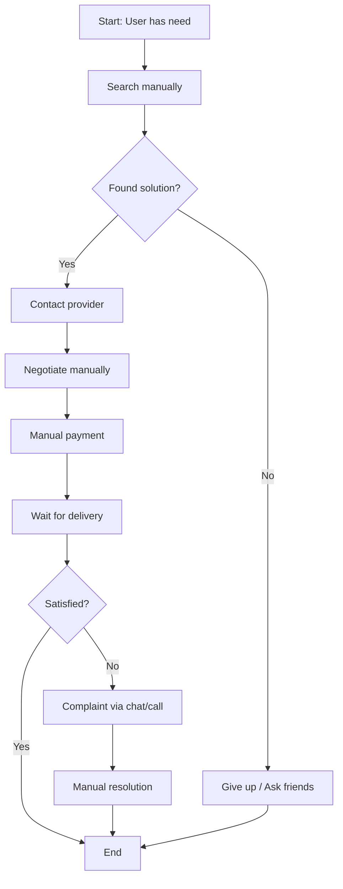

# Business Flow — AS-IS

> **Status**: 📝 Draft
> **Last Updated**: YYYY-MM-DD

---

## Overview

Dokumentasi alur bisnis saat ini (sebelum ada solusi digital).

## Current Process Flow

## Current Pain Points

| Step | Pain Point | Severity | Frequency |
|------|-----------|----------|-----------|
| Search | Tidak ada platform terpusat | High | Every time |
| Contact | Harus hubungi satu per satu | High | Every time |
| Payment | Tidak ada escrow/jaminan | Critical | Every time |
| Tracking | Tidak bisa track status | Medium | Every time |
| Resolution | Proses komplain manual | High | Frequent |

## Process Metrics (Current)

| Metric | Current Value | Pain Level |
|--------|-------------|-----------|
| Time to complete | | 🔴 |
| Success rate | | 🔴 |
| Customer satisfaction | | 🟡 |
| Cost per transaction | | 🟡 |

## Stakeholders in Current Process

| Role | Responsibility | Pain Points |
|------|---------------|------------|
| | | |

---

> **Compare with**: [TO-BE Flow](to-be.md)
