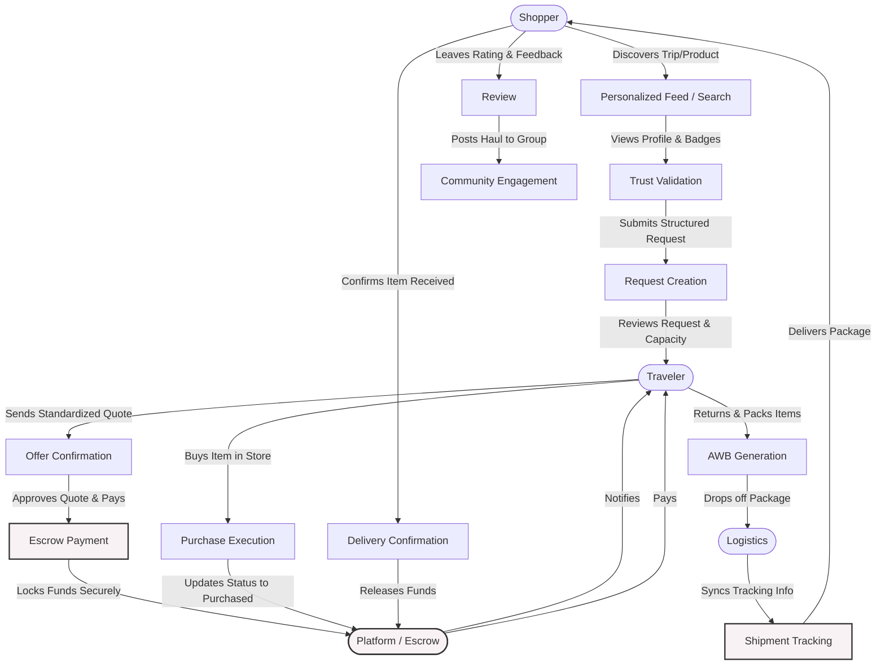

# Business Flow — TO-BE

---

# 1. Overview

The implementation of "My Trip My Titipan" fundamentally shifts the jastip (personal shopper) economy from a fragmented, high-friction, and informal practice into a structured, scalable, and secure Digital Social Commerce ecosystem.

The future-state platform acts as the central infrastructure layer, transforming how users interact across five core pillars:
*   **Discovery:** Transitioning from scattered social media hashtags to a unified, personalized feed where shoppers discover products through traveler itineraries, creators, and destination highlights.
*   **Trust Building:** Replacing risky direct bank transfers and unverified claims with integrated KYC (Know Your Customer) identity verification, a structured reputation system, and escrow-protected payments.
*   **Commerce:** Standardizing the negotiation and transaction process, moving away from unstructured WhatsApp chats to a seamless, in-app Product Request and Quoting system.
*   **Trip-Based Shopping:** Empowering travelers with a "Trip Planner" that broadcasts their physical locations (Jastip by Spot), allowing them to efficiently crowd-source demand before and during their travels.
*   **Community Interaction:** Fostering niche communities (e.g., "Tokyo Sneakerheads", "K-Beauty Addicts") that pool requests, share reviews, and drive organic, retention-focused growth.

---

# 2. Future Ecosystem Overview

The new ecosystem formally defines and supports multiple interconnected stakeholders:

| Stakeholder | Role |
| :--- | :--- |
| **Shopper** | The primary consumer who discovers products/destinations, joins communities, submits Product Requests, and pays securely via Escrow. |
| **Traveler (Jastiper)** | The service provider who shares their Trip Planner, accepts requests, purchases items abroad, and fulfills deliveries to earn margins and build a reputation. |
| **Creator** | Influencers and reviewers who produce content about destinations or products, embedding actionable "Request this from a Traveler" links to monetize their influence. |
| **Community** | Groups of like-minded shoppers and experts (e.g., European Luxury, Asian Snacks) that curate demand, share knowledge, and provide social proof. |
| **Platform (My Trip My Titipan)** | The orchestrator that provides the infrastructure: feed algorithms, Escrow management, identity verification, dispute resolution, and community hosting. |
| **Payment Provider** | Integrated third-party gateways (Virtual Accounts, E-Wallets, Credit Cards) facilitating secure deposits into the platform's Escrow system. |
| **Logistics Provider** | Integrated domestic shipping partners (APIs) enabling automated airway bill (AWB) generation and real-time tracking for the final mile delivery. |

---

# 3. Future Business Flow

The future business flow formalizes the lifecycle from initial desire to post-purchase advocacy:

1.  **Need Identification:** A Shopper is inspired by a Creator's video, a Community post, or a specific necessity for an unavailable product.
2.  **Discovery:** The Shopper uses the platform's Personalized Feed or Search to find a Traveler heading to the required destination, or browses "Jastip by Spot" for specific stores.
3.  **Trust Validation:** The Shopper checks the Traveler’s profile for the "Verified Identity" badge, reviews their historical success rate, and reads feedback from the Community.
4.  **Request Creation:** The Shopper submits a structured Product Request, including images, reference URLs, and an acceptable price range, directly through the platform.
5.  **Offer Negotiation:** The Traveler receives the request, reviews their luggage capacity, and sends a standardized Offer containing the final price (Item Cost + Jastip Fee + Estimated Shipping).
6.  **Escrow Payment:** The Shopper accepts the Offer and transfers funds. The money is securely locked in the platform's Escrow system; it is not sent directly to the Traveler.
7.  **Purchase Execution:** The Traveler physically purchases the item during their trip. They update the platform status to "Purchased," optionally uploading a photo of the receipt or item.
8.  **Shipping:** Upon returning home, the Traveler packs the items. The platform automatically generates a shipping label via integrated Logistics Providers. The Traveler drops off the package.
9.  **Delivery:** The Logistics Provider delivers the item to the Shopper. Tracking is automatically synced within the app.
10. **Review & Reputation:** The Shopper confirms receipt, which automatically triggers the Escrow Release to the Traveler's wallet. The Shopper leaves a rating and review.
11. **Community Engagement:** The Shopper shares their successful purchase in a Community group, acting as organic marketing and driving further demand for the Traveler's next trip.

---

# 4. TO-BE Process Flow Diagram

---

# 5. Discovery Flows

Discovery in the TO-BE state is multi-dimensional and algorithmic, replacing the reliance on manual social media searches.

### Traveler-Based Discovery
Shoppers follow specific "Expert Travelers." When a Traveler updates their Trip Planner (e.g., "Heading to Seoul next month"), their followers receive a notification to start submitting requests.

### Destination-Based Discovery
Shoppers explore curated destination pages. Selecting "Paris" displays trending French products, Creators reviewing Parisian goods, and a list of all verified Travelers scheduled to visit France soon.

### Spot-Based Discovery
Through the "Jastip by Spot" feature, Travelers pin specific physical locations on their itinerary (e.g., "Gotemba Premium Outlets"). Shoppers discover these spots and request specific items known to be sold there.

### Product-Based Discovery
Shoppers search for a specific item (e.g., "Gentle Monster Sunglasses"). The platform matches the item with Travelers currently in, or soon traveling to, a location where the item is available.

### Creator-Based Discovery
A Shopper watches a Creator's embedded review video. Below the video, the platform dynamically displays Travelers who can procure that exact item, creating a direct path from inspiration to transaction.

### Community-Based Discovery
Within the "Luxury Watch Enthusiasts" community, members discuss a new release. A Traveler within the group announces a trip to Switzerland, and discovery happens organically through trusted group interaction.

---

# 6. Trust Flow

Trust is transformed from a leap of faith into a system-guaranteed feature.

*   **KYC Verification:** Before a Traveler can accept requests or withdraw funds, they must pass identity verification (ID card and biometric scan), establishing baseline accountability.
*   **Reputation System:** Every completed transaction contributes to a public Success Rate metric, prominently displayed on the Traveler’s profile.
*   **Reviews:** Granular reviews (communication, packaging quality, speed) replace informal Instagram comments, providing qualitative proof.
*   **Expertise Badges:** Travelers earn platform-verified badges (e.g., "100+ Deliveries", "Japan Specialist") that visually communicate reliability to new Shoppers.
*   **Escrow Protection:** The core trust mechanism. Shoppers know their money is held by the platform, not the Traveler, eliminating the risk of upfront deposit fraud.
*   **Community Signals:** Active participation and positive endorsements within Community groups serve as powerful, peer-driven trust signals.

---

# 7. Commerce Flow

The commerce flow shifts from unstructured chat to a platform-managed lifecycle.

*   **Product Request:** Replaces WhatsApp DMs. Shoppers fill out a specific form detailing the item, required variants, and maximum willingness to pay.
*   **Price Confirmation:** Replaces manual spreadsheet calculations. The Traveler inputs the base cost and jastip fee; the platform automatically calculates real-time exchange rates and platform fees, presenting a clean quote to the Shopper.
*   **Escrow Payment:** Replaces direct bank transfers. The Shopper pays via integrated gateways. The platform holds the funds.
*   **Purchase Execution:** The Traveler buys the item. The platform provides a unified dashboard for the Traveler to manage all accepted requests, replacing manual notes.
*   **Shipment:** Replaces manual airway bills. The platform API generates tracking numbers from logistics partners directly in the app.
*   **Delivery:** Real-time tracking updates are pushed to the Shopper, reducing "where is my package" inquiries.
*   **Escrow Release:** Once the Shopper confirms delivery (or after a timeout period), the platform automatically routes the funds to the Traveler's digital wallet.

---

# 8. Community Flow

Community interaction is the engine for retention and organic growth.

*   **Following Travelers & Creators:** Shoppers build a personalized feed by following entities they trust, ensuring they are always aware of upcoming travel opportunities.
*   **Joining Communities:** Users join niche groups based on interests (e.g., K-Pop merch, regional snacks).
*   **Sharing Experiences:** After a successful delivery, Shoppers are prompted to share their "haul" in relevant communities, providing social proof for the Traveler and inspiring others.
*   **Recommendations:** Community members answer questions and recommend reliable Travelers for specific types of goods.
*   **Repeat Requests:** The social nature of the platform keeps Shoppers engaged between transactions, dramatically increasing the likelihood of repeat requests when a trusted Traveler announces a new trip.

---

# 9. Improvements vs AS-IS

| Area | AS-IS | TO-BE | Business Impact |
| :--- | :--- | :--- | :--- |
| **Discovery** | Manual hashtag searches on Instagram; highly fragmented. | Algorithmic, personalized feeds and integrated destination/spot browsing. | Increases request volume and matches demand with supply faster. |
| **Trust** | Reliance on blind faith and unverified social media profiles. | KYC Verification, Escrow, and public Reputation Scores. | Dramatically lowers the barrier to entry for new shoppers; reduces fraud to near zero. |
| **Communication** | Messy WhatsApp chats mixed with personal messages. | Structured in-app Requests and automated status updates. | Reduces Traveler burnout and Shopper anxiety. |
| **Order Management**| Manual tracking via Excel spreadsheets and phone notes. | Centralized Traveler dashboard managing requests, quotes, and fulfillment. | Allows Travelers to handle significantly higher order volumes per trip. |
| **Payment** | Direct, un-escrowed Bank Transfers requiring manual receipt checks. | Integrated payment gateways with automated Escrow holding. | Unlocks platform revenue via transaction fees and secures the ecosystem. |
| **Tracking** | Manual sharing of receipt photos via chat. | API-integrated logistics with automated push notifications. | Enhances the post-purchase customer experience. |
| **Reputation** | Disjointed "thank you" stories on Instagram. | Persistent, quantifiable reviews and expertise badges. | Creates a meritocracy where the best Travelers rise to the top. |
| **Community** | Isolated Telegram/WhatsApp groups. | Native in-app communities linked directly to commerce workflows. | Drives high retention, organic discovery, and network effects. |

---

# 10. Automation Opportunities

| Process | Automation | Priority | Business Impact |
| :--- | :--- | :--- | :--- |
| **Matching** | Suggesting Travelers based on a Shopper's recent searches or Wishlist items. | High | Increases conversion rates by surfacing relevant supply. |
| **Notifications** | Automated alerts when a followed Traveler posts a new Trip Plan. | High | Drives immediate request generation without manual marketing by the Traveler. |
| **Escrow Management**| Auto-release of funds 48 hours after courier confirms delivery if no dispute is raised. | Critical | Ensures Travelers get paid promptly while protecting the platform from manual operational overhead. |
| **Reputation Scoring**| Dynamically calculating Success Rates based on fulfilled vs. canceled orders. | High | Maintains platform integrity and trust automatically. |
| **Recommendations** | Curating the Feed based on community membership and past purchases. | Medium | Increases user engagement time and discovery of new products. |
| **Tracking Updates** | Polling logistics APIs to push "Out for Delivery" and "Delivered" statuses. | High | Reduces customer support tickets and Traveler messaging burden. |

---

# 11. Target Business Outcomes

| Outcome | Current State (AS-IS) | Future State (TO-BE) |
| :--- | :--- | :--- |
| **Transaction Transparency** | Low; hidden fees and dynamic exchange rate disputes are common. | High; standardized quoting with explicit breakdowns of item cost, fees, and shipping. |
| **Customer Confidence** | Low; fear of "hit and run" scams prevents market expansion. | High; Escrow and KYC guarantees transaction safety. |
| **Traveler Productivity** | Low; heavily constrained by manual administrative work. | High; streamlined workflows allow Travelers to double or triple their order capacity. |
| **Community Engagement** | Fragmented; occurs outside the commerce loop. | Integrated; community activity directly drives product discovery and transactions. |
| **Repeat Transactions** | Inconsistent; relies on shoppers manually remembering a Traveler. | High; driven by automated notifications, feed integration, and trusted relationships. |

---

# 12. Success Metrics

| KPI | Current (Proxy/Estimate) | Target (Platform Implementation) |
| :--- | :--- | :--- |
| **Request Conversion Rate** | Unknown (lost in DMs) | > 40% of structured requests result in a funded Escrow. |
| **Transaction Completion Rate**| ~70% (high cancellation/stock issues) | > 85% successful fulfillment of funded requests. |
| **Escrow Adoption Rate** | 0% (Direct Transfer) | 100% (Mandatory for platform protection). |
| **Repeat Transaction Rate** | ~20% | > 45% within a 6-month window. |
| **Community Participation Rate**| N/A | > 60% of active users belong to at least one Community. |
| **Customer Satisfaction Score** | Highly variable | > 4.5 / 5.0 platform average. |

---

# 13. Strategic Transformation Summary

The implementation of "My Trip My Titipan" orchestrates a fundamental shift from a chaotic, informal side-hustle into a robust, structured digital economy.

By moving away from **Informal Commerce**, **Trust-Based Transactions** (blind faith), and **Manual Coordination**, the platform introduces a paradigm of **Structured Social Commerce**. It establishes a **Verified Trust Infrastructure** where Escrow and KYC eliminate the primary barrier to entry—fear of fraud. 

Simultaneously, by deeply integrating **Trip-Based Commerce** and **Community-Driven Growth**, the platform does not merely digitize existing transactions; it creates entirely new pathways for discovery. Travelers become localized experts, Creators become actionable storefronts, and Communities become dynamic marketplaces. Ultimately, the platform empowers users to explore the world and acquire its unique products through the trusted suitcases of a verified, global community.
