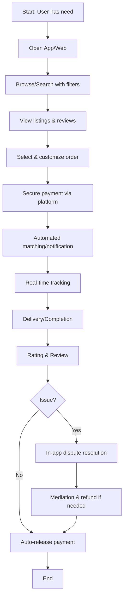

# Business Flow — TO-BE

> **Status**: 📝 Draft
> **Last Updated**: YYYY-MM-DD

---

## Overview

Alur bisnis yang diinginkan setelah implementasi solusi digital.

## Proposed Process Flow

## Improvements vs AS-IS

| Aspect | AS-IS | TO-BE | Improvement |
|--------|-------|-------|-------------|
| Search | Manual, scattered | Centralized platform | ⬆️ Efficiency |
| Trust | No verification | Ratings, reviews, escrow | ⬆️ Trust |
| Payment | Cash/transfer, no protection | Secure in-app payment | ⬆️ Security |
| Tracking | None | Real-time tracking | ⬆️ Transparency |
| Support | Manual via call/chat | In-app resolution center | ⬆️ Speed |
| Discovery | Word of mouth | Algorithm-based matching | ⬆️ Reach |

## Target Metrics (TO-BE)

| Metric | Current | Target | Improvement |
|--------|---------|--------|-------------|
| Time to complete | | | - % |
| Success rate | | | + % |
| Customer satisfaction | | | + % |
| Cost per transaction | | | - % |

## Automation Opportunities

| Process | Automation Type | Priority |
|---------|----------------|----------|
| Matching user to provider | AI/Algorithm | High |
| Payment processing | Payment gateway | Critical |
| Notifications | Push/Email/SMS | High |
| Dispute resolution | Rule-based + manual | Medium |
| Analytics & reporting | Automated dashboards | Medium |

---

> **Compare with**: [AS-IS Flow](as-is.md)
> **Input to**: [System Architecture](../../04-technical/system-architecture.md), [User Journey](../../02-product/user-journey.md)
