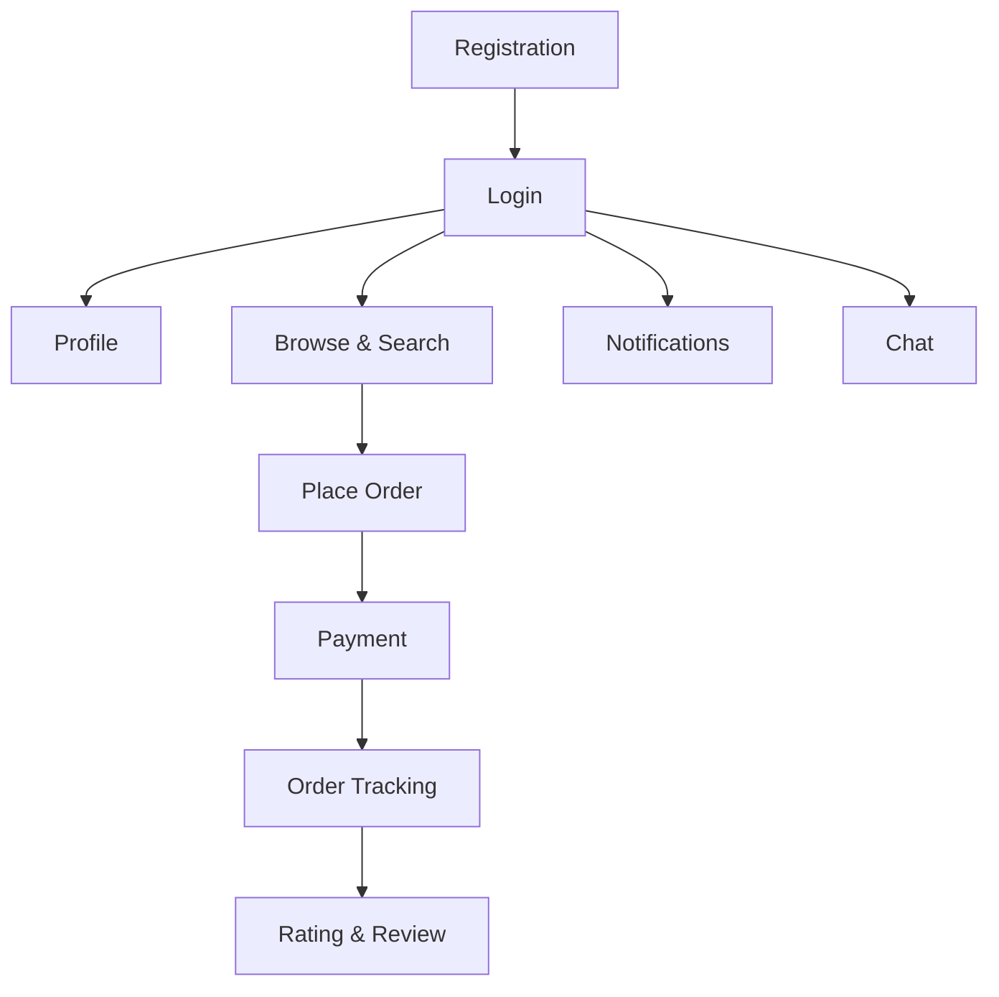

# Feature Prioritization

> **Status**: 📝 Draft
> **Last Updated**: YYYY-MM-DD
> **Method**: MoSCoW + RICE Scoring

---

## 1. MoSCoW Prioritization

### Must Have (MVP)

| Feature | Reason | User Story |
|---------|--------|-----------|
| User Registration & Login | Core access | US-001 |
| Browse & Search | Core functionality | US-002 |
| Place Order | Core transaction | US-003 |
| Payment | Revenue enabler | US-004 |
| Basic Profile | User identity | US-005 |

### Should Have (v1.1)

| Feature | Reason | User Story |
|---------|--------|-----------|
| Rating & Reviews | Trust building | |
| Notifications | Engagement | |
| Order Tracking | Transparency | |
| Chat | Communication | |

### Could Have (v1.2+)

| Feature | Reason | User Story |
|---------|--------|-----------|
| Recommendations | Personalization | |
| Loyalty Program | Retention | |
| Social Sharing | Viral growth | |
| Multi-language | Market expansion | |

### Won't Have (This Release)

| Feature | Reason | Revisit |
|---------|--------|---------|
| AI Chatbot | Complexity | Q3 |
| Marketplace | Scope | Q4 |

---

## 2. RICE Scoring

| Feature | Reach | Impact | Confidence | Effort | RICE Score | Priority |
|---------|-------|--------|-----------|--------|-----------|----------|
| | 1-10 | 1-3 | 50-100% | weeks | (R×I×C)/E | |
| User Registration | 10 | 3 | 100% | 2 | 15.0 | 1 |
| Browse & Search | 10 | 3 | 90% | 3 | 9.0 | 2 |
| Payment | 8 | 3 | 80% | 4 | 4.8 | 3 |
| Notifications | 7 | 2 | 70% | 2 | 4.9 | 4 |
| Chat | 5 | 2 | 60% | 3 | 2.0 | 5 |

> **RICE Formula**: (Reach × Impact × Confidence) / Effort

## 3. Feature Dependencies

## 4. Release Plan

| Release | Features | Target Date | Theme |
|---------|----------|-------------|-------|
| MVP (v1.0) | Must Have features | | Core Experience |
| v1.1 | Should Have features | | Trust & Engagement |
| v1.2 | Could Have features | | Growth & Retention |

---

> **Input dari**: [PRD](prd.md), [Competitor Analysis](../01-business/01-discovery/competitor-analysis.md)
> **Output ke**: [Product Roadmap](product-roadmap.md), [Sprint Planning]
