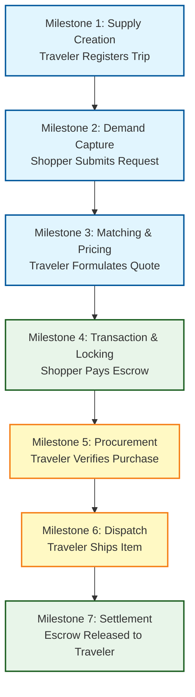

# High-Level Business Milestones & Process Flow

> **Status**: 📝 Draft **Last Updated**: 2026-06-14

This document defines the high-level business process flow and operational milestones of the **My Trip My Titipan** MVP. It focuses on the core transaction loop and platform business rules, omitting user interface (UI) and user experience (UX) layout specifics.

---

## 1. Core Business Milestones

The platform's business model relies on a peer-to-peer (P2P) matching mechanism where travelers monetize their unused suitcase capacity, and shoppers gain access to items from abroad. The lifecycle of a single match progresses through seven distinct milestones.

### Milestone 1: Supply Creation (Trip Registration)
* **Description:** A traveler registers and publishes an upcoming journey, declaring travel dates, destinations, and available baggage capacity.
* **Business Rules:**
  * Traveler must specify departure and return dates (must be in the future).
  * Traveler must declare maximum baggage weight dedicated to jastip (e.g., in kilograms).
  * System generates a unique, immutable trip URL for external sharing.
* **Output:** Active Trip record with status `Open`.

### Milestone 2: Demand Capture (Request Submission)
* **Description:** A shopper visits the traveler's public trip page and submits a structured request for a specific product.
* **Business Rules:**
  * Shopper must declare the exact Item Name, Reference Link, Quantity, Willingness to Pay, and upload a visual reference (photo).
  * Multiple shoppers can request items on the same trip up to the traveler's capacity limits.
* **Output:** Product Request record created with status `Requested`.

### Milestone 3: Matching & Pricing (Offer Formulation)
* **Description:** The traveler reviews the shopper's product request and proposes concrete financial terms.
* **Business Rules:**
  * Traveler must submit a quotation specifying: **Item Price** (base price) + **Jastip Fee** (traveler profit margins) + **Estimated Weight** (slots deduction).
  * System automatically sets a 24-hour expiration window on the quote.
  * System reserves the estimated baggage capacity.
* **Output:** Quotation created; order status updated to `Quoted`.

### Milestone 4: Transaction & Locking (Escrow Funding)
* **Description:** The shopper accepts the quotation and funds the order, locking the money in the platform escrow.
* **Business Rules:**
  * Shopper must pay the full quotation amount (Item Price + Jastip Fee) via the integrated payment gateway within the 24-hour window.
  * Upon payment, the reserved baggage capacity is converted to `Locked Capacity`.
  * If the shopper fails to pay within 24 hours, the quote is marked `Expired` and the reserved capacity is automatically released back to the traveler's trip.
* **Output:** Escrow funded; order status updated to `Paid`.

### Milestone 5: Procurement (Item Purchase & Verification)
* **Description:** The traveler travels to the destination and purchases the requested item, verifying the procurement.
* **Business Rules:**
  * Traveler uses their own cash/card to buy the item abroad.
  * Traveler marks the item as `Purchased` and optionally uploads a photo of the item/receipt as verification.
* **Output:** Procurement verified; order status updated to `Purchased`.

### Milestone 6: Logistics Dispatch (Domestic Shipping)
* **Description:** The traveler returns to the home country and ships the item domestically to the shopper.
* **Business Rules:**
  * Traveler is responsible for packaging and dropping the item at a domestic shipping courier.
  * Traveler must input a valid tracking number into the platform.
* **Output:** Tracking number registered; order status updated to `In Transit`.

### Milestone 7: Settlement (Delivery & Escrow Release)
* **Description:** The shopper receives the item, triggering the payout of escrow funds to the traveler.
* **Business Rules:**
  * Shopper confirms delivery manually to release escrow immediately.
  * If the shopper fails to confirm within 7 calendar days after shipment, the platform executes an automated settlement, releasing escrow funds to the traveler.
* **Output:** Funds transferred to traveler's bank account; order status updated to `Completed`.

---

## 2. Platform Guardrails & MVP Limits

To maintain operational feasibility and comply with development cycles, the MVP strictly enforces the following platform-level boundaries:

1. **No Discovery Feed / Search:** The MVP operates as a shareable link-only utility. Shoppers cannot browse trips on a public feed. Matching is initiated only when a traveler shares their link.
2. **No Integrated Chat:** Communication is structured strictly through forms (Requests and Quotes). No conversational in-app chat is available in the MVP.
3. **No KYC at Launch:** User verification is deferred to post-MVP. Platform trust is managed through transaction counts, ratings, and social proof.
4. **No Direct Traveler Capital Funding:** Travelers must front the money to purchase items abroad. The platform does not advance funds prior to delivery confirmation.
