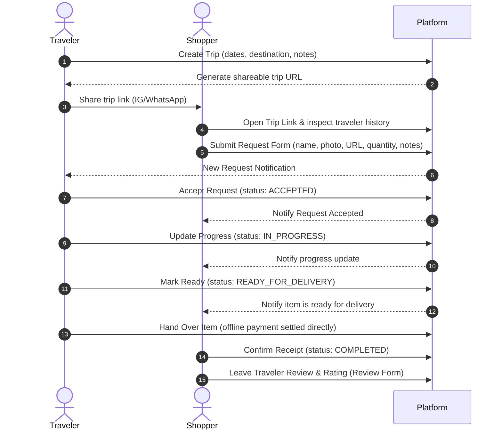

# Core User Flow

> **Status**: Approved **Last Updated**: 2026-06-14

This document defines the primary happy path user flow for the Phase 1 Foundation MVP.

---

## 1. Actors & Objectives
*   **Traveler:** Publishes upcoming itineraries, accepts requests, and manual updates request status as they buy/ship.
*   **Shopper:** Submits structured item requests, tracks the timeline, confirms receipt, and reviews the traveler.
*   **Goal:** Enable request list tracking and progress coordination without payment/escrow constraints.

---

## 2. Happy Path Flow Sequence

### Flow Steps Details:
1.  **Supply Creation:** Traveler registers destination, travel dates, and optional notes (space limits, preferred stores) and copies the generated link.
2.  **Request Submission:** Shopper visits trip page, authenticates (Google/OTP), reviews traveler's completed requests/reviews, and submits request details (item name, photo, reference URL, quantity, notes).
3.  **Acceptance:** Traveler reviews incoming request backlog and clicks "Accept Request", shifting the request state to `ACCEPTED`.
4.  **Fulfillment Coordination:** Traveler updates progress to `IN_PROGRESS` while sourcing or handling coordination, and then clicks "Mark Ready" to shift the request state to `READY_FOR_DELIVERY`. Offline payment and handover methods are settled directly.
5.  **Receipt & Review:** Shopper receives the item, clicks "Confirm Receipt" (moving the request state to `COMPLETED`), and fills the review form with a star rating and written feedback.