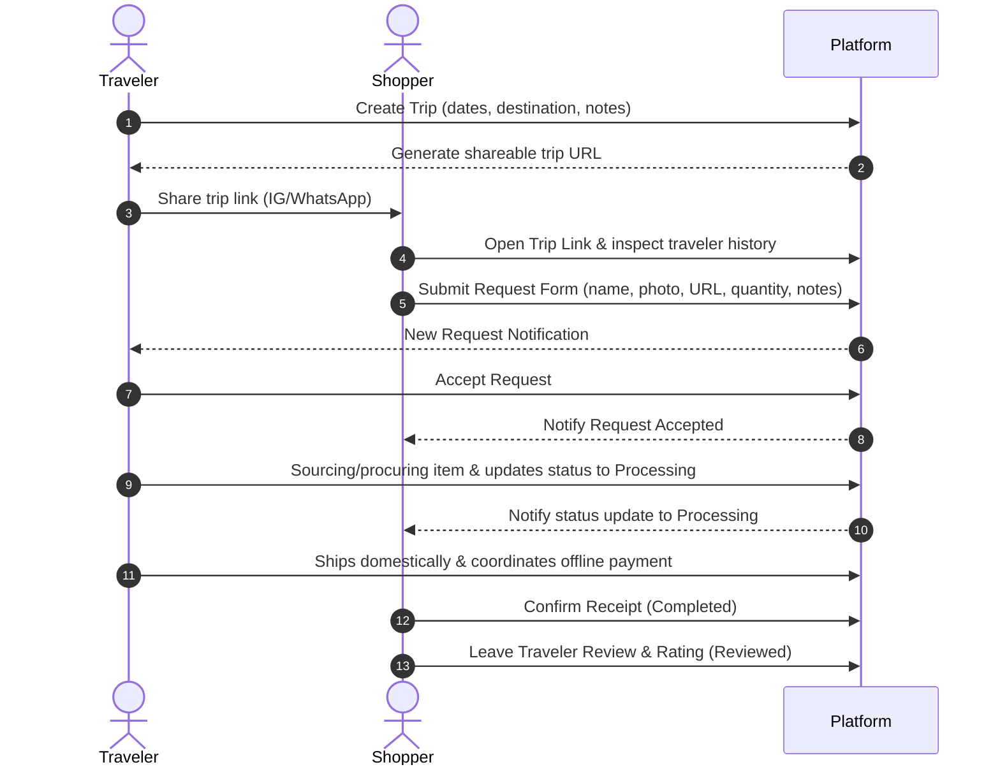

# Core User Flow

> **Status**: Approved **Last Updated**: 2026-06-14

This document defines the primary happy path user flow for the Phase 1 Foundation MVP.

---

## 1. Actors & Objectives
*   **Traveler:** Publishes upcoming itineraries, accepts requests, and manual updates request status as they buy/ship.
*   **Shopper:** Submits structured item requests, tracks the timeline, confirms receipt, and reviews the traveler.
*   **Goal:** Enable request list tracking and progress coordination without payment/escrow constraints.

---

## 2. Happy Path Flow Sequence

### Flow Steps Details:
1.  **Supply Creation:** Traveler registers destination, travel dates, and optional notes (space limits, preferred stores) and copies link.
2.  **Request Submission:** Shopper visits trip page, authenticates (Google/OTP), enters item name, photo, reference URL, quantity, and notes. Submits it.
3.  **Acceptance:** Traveler reviews incoming request backlog, selects request, and clicks "Accept".
4.  **Updates:** Traveler procures the item, ships it, and clicks "Update to Processing" to indicate fulfillment. Offline payment is settled directly.
5.  **Receipt & Review:** Shopper receives the item, clicks "Confirm Receipt" (completing the request), and leaves a star rating and written feedback review.