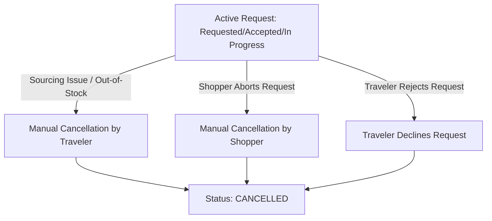

# Exception Flows & Offline Coordination

> **Status**: Approved **Last Updated**: 2026-06-14

This document defines exception handling workflows and pre-delivery cancellations for the Phase 1 Foundation MVP.

---

## 1. Exception State Map

---

## 2. Phase 1 Exception Scenarios

### Scenario A: Traveler Declines Request (Pre-Acceptance)
*   **Trigger:** Traveler reviews an incoming request in `Requested` status and decides they cannot procure it (e.g. prohibited item, unreachable store, excessive size).
*   **Action:** Traveler clicks "Decline Request".
*   **Outcome:** Request status transitions to `Cancelled`. The shopper is notified.

### Scenario B: Traveler Sourcing Issue (Post-Acceptance)
*   **Trigger:** Traveler has accepted the request but finds the item is out-of-stock, or their travel itinerary changes.
*   **Action:** Traveler clicks "Cancel Request" and enters an optional reason.
*   **Outcome:** Request status transitions to `Cancelled`. The shopper is notified.

### Scenario C: Shopper Aborts Request (Post-Acceptance)
*   **Trigger:** Shopper decides they no longer need the item or sourced it elsewhere.
*   **Action:** Shopper clicks "Cancel Request" (only available before status changes to `In Progress`).
*   **Outcome:** Request status transitions to `Cancelled`. The traveler is notified.

---

## 3. Financial & Dispute Guardrails (Offline Coordination)

Because payment processing and escrow are out of scope for the Phase 1 MVP, the platform enforces the following rules for dispute resolution:

1.  **Direct P2P Agreement:** Any deposits, payment transfers, cash exchange, or reimbursement for purchases are coordinated entirely offline between the Shopper and the Traveler.
2.  **No Financial Liability:** The platform is not responsible for escrowing, refunding, or tracking currency values.
3.  **Dispute Settlement:** If a shopper is unsatisfied with a delivery, they negotiate directly with the traveler offline. The shopper can reflect a bad experience through the star ratings and written reviews system after the request reaches `Completed` status.
