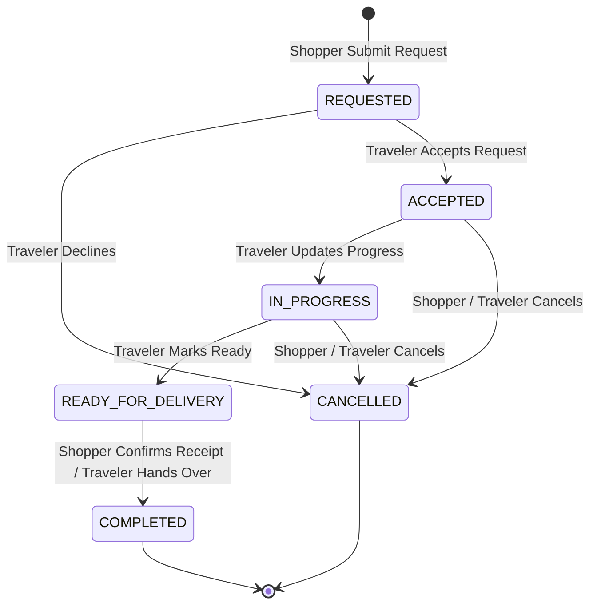

# Request Status Lifecycle (Phase 1)

> **Status**: Approved **Last Updated**: 2026-06-17

This document defines the formal request state machine and status transitions for the Phase 1 Foundation MVP.

---

## 1. State Glossary

| Status | Actor Trigger | Description |
| :--- | :--- | :--- |
| **REQUESTED** | Shopper submits request | Initial state when a shopper requests an item from a traveler's trip link. |
| **ACCEPTED** | Traveler accepts request | Traveler reviews item details and clicks "Accept Request", committing to fulfill it. |
| **IN_PROGRESS** | Traveler updates progress | Traveler starts coordination or sourcing and updates progress. |
| **READY_FOR_DELIVERY** | Traveler marks ready | Sourcing/coordination is complete and the item is ready to be handed over/delivered. |
| **COMPLETED** | Shopper confirms receipt / Traveler hands over | Handover is successful and receipt is confirmed, completing the happy path. |
| **CANCELLED** | Traveler declines / either aborts | Pre-delivery decline by traveler or cancellation request from either actor. |

---

## 2. State Transition Matrix

| Source State | Event Trigger | Target State | Actor | Actions Taken / Side Effects |
| :--- | :--- | :--- | :--- | :--- |
| *(None)* | Submit Request Form | **REQUESTED** | Shopper | Creates request record; notifies traveler; appends timeline log. |
| **REQUESTED** | traveler clicks "Accept Request" | **ACCEPTED** | Traveler | Commits to request; notifies shopper; updates timeline log. |
| **REQUESTED** | traveler clicks "Decline" | **CANCELLED** | Traveler | Rejects request; notifies shopper; updates timeline log. |
| **ACCEPTED** | traveler clicks "Update Progress" | **IN_PROGRESS** | Traveler | Traveler starts sourcing/delivery prep; updates timeline log. |
| **IN_PROGRESS** | traveler clicks "Mark Ready" | **READY_FOR_DELIVERY**| Traveler | Marks item as ready to deliver; updates timeline log. |
| **ACCEPTED** / **IN_PROGRESS** | either clicks "Cancel Request" | **CANCELLED** | Traveler/Shopper | Cancels request (only allowed before ready); updates timeline log. |
| **READY_FOR_DELIVERY** | shopper clicks "Confirm Receipt" or traveler clicks "Hand Over" | **COMPLETED** | Shopper/Traveler | Confirms delivery/handover; updates timeline; enables review form. |

---

## 3. Mermaid State Diagram

