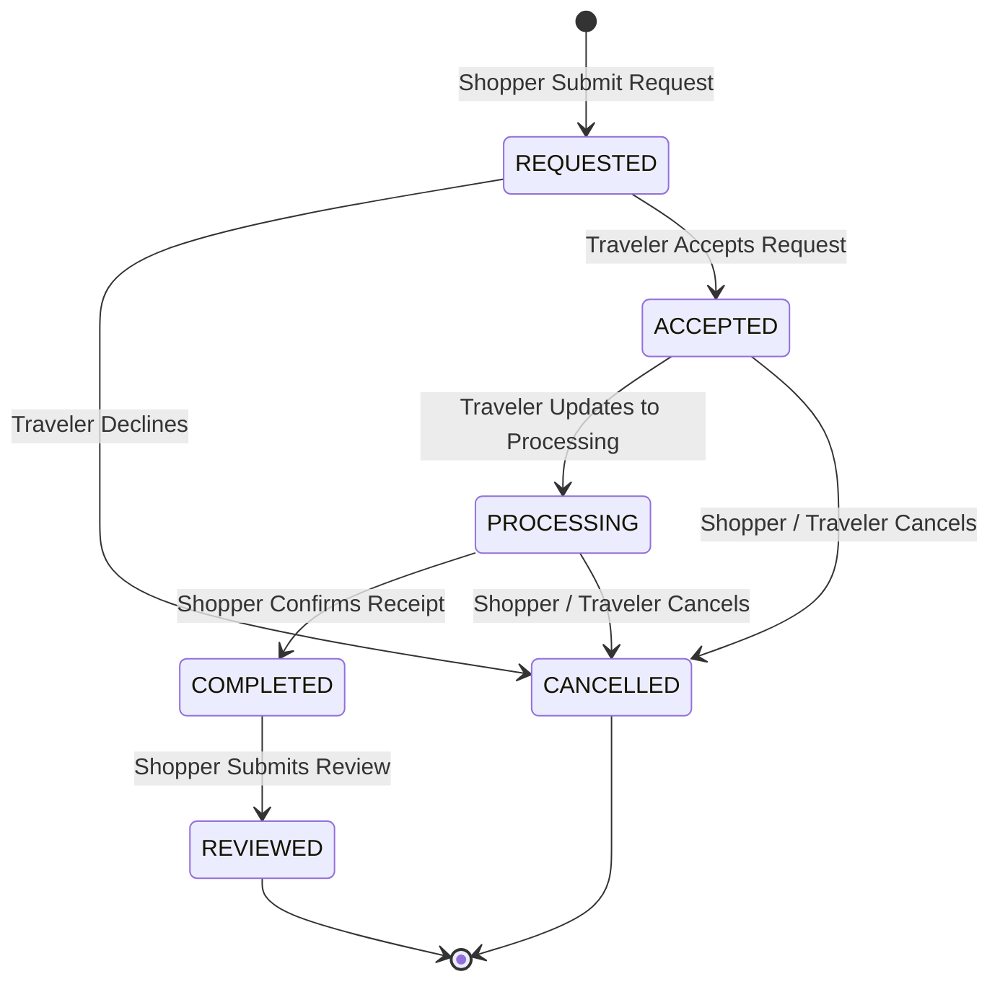

# Request Status Lifecycle (Phase 1)

> **Status**: Approved **Last Updated**: 2026-06-14

This document defines the formal order state machine and request status transitions for the Phase 1 Foundation MVP.

---

## 1. State Glossary

| Status | Actor Trigger | Description |
| :--- | :--- | :--- |
| **REQUESTED** | Shopper submits request | Initial state when a shopper requests an item from a traveler's trip link. |
| **ACCEPTED** | Traveler accepts request | Traveler reviews item details and clicks "Accept", committing to source it. |
| **PROCESSING** | Traveler starts procurement | Traveler updates request status to indicate they are traveling/buying/delivering the item. |
| **COMPLETED** | Shopper confirms receipt | Shopper confirms receipt of the physical package, completing the happy path. |
| **REVIEWED** | Shopper leaves review | Shopper completes a star rating and written review for the traveler. |
| **CANCELLED** | Traveler declines / either aborts | Pre-delivery decline by traveler or cancellation request from either actor. |

---

## 2. State Transition Matrix

| Source State | Event Trigger | Target State | Actor | Actions Taken / Side Effects |
| :--- | :--- | :--- | :--- | :--- |
| *(None)* | Submit Request Form | **REQUESTED** | Shopper | Creates request record; notifies traveler; appends timeline log. |
| **REQUESTED** | traveler clicks "Accept" | **ACCEPTED** | Traveler | Commits to request; notifies shopper; updates timeline log. |
| **REQUESTED** | traveler clicks "Decline" | **CANCELLED** | Traveler | Rejects request; notifies shopper; updates timeline log. |
| **ACCEPTED** | traveler clicks "Update to Processing"| **PROCESSING**| Traveler | Indicates travel/procurement phase; notifies shopper; updates timeline log. |
| **ACCEPTED** / **PROCESSING** | either clicks "Cancel Request" | **CANCELLED** | Traveler/Shopper| Cancels request; notifies counterpart; updates timeline log. |
| **PROCESSING** | shopper clicks "Confirm Receipt" | **COMPLETED** | Shopper | Confirms physical delivery; triggers reviews screen; updates timeline. |
| **COMPLETED** | shopper submits review form | **REVIEWED** | Shopper | Appends review/rating; updates traveler aggregate score; updates timeline. |

---

## 3. Mermaid State Diagram

