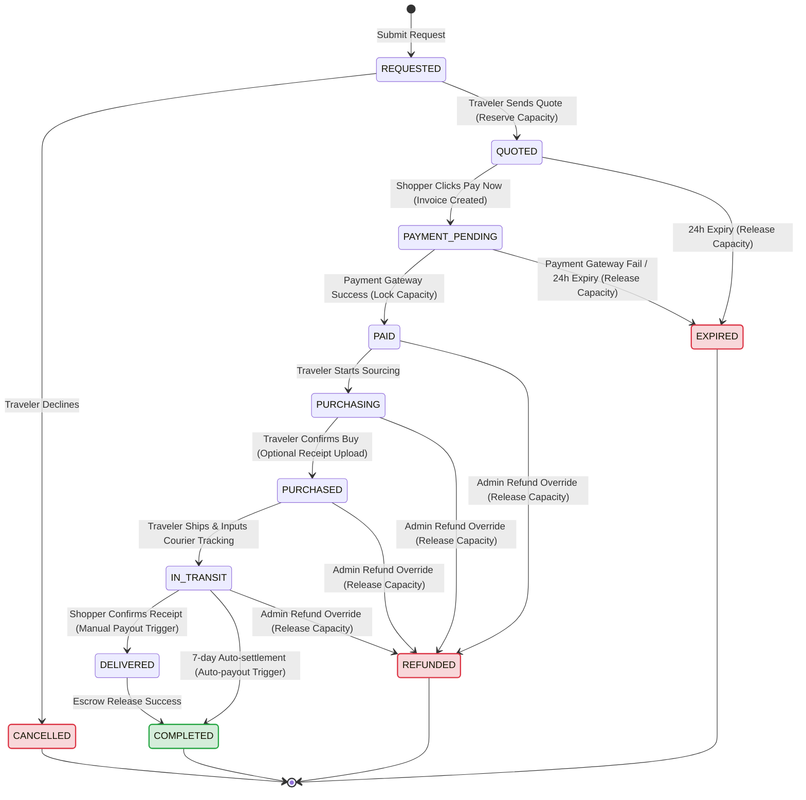

# Order & Payment State Machine Specifications

> **Status**: 📝 Draft **Last Updated**: 2026-06-14

This document defines the formal state machine governing the order lifecycle and payment statuses within the **My Trip My Titipan** platform. It aligns business triggers with database transitions to provide clear implementation blueprints for systems architects (SAA) and backend developers (DAA).

---

## 1. State Glossary

| State | Lifecycle Stage | Description |
| :--- | :--- | :--- |
| **REQUESTED** | Pre-Payment | Shopper has filled the product request form and submitted it. |
| **QUOTED** | Pre-Payment | Traveler has reviewed the request and proposed concrete pricing (Item Price + Jastip Fee). |
| **PAYMENT_PENDING** | Pre-Payment | Shopper has initiated checkout; payment gateway invoice is open. |
| **PAID** | Fulfillment | Payment gateway webhook confirmed success. Funds are held in escrow. |
| **PURCHASING** | Fulfillment | Traveler is active in procurement (abroad or local shopping phase). |
| **PURCHASED** | Fulfillment | Traveler bought the item and verified it (optional photo/receipt uploaded). |
| **IN_TRANSIT** | Fulfillment | Traveler returned and shipped the item domestically, inputting tracking details. |
| **DELIVERED** | Fulfillment | Shopper confirmed receipt of the package, or shipping webhook reports arrival. |
| **COMPLETED** | Closed | Escrow funds have been successfully settled/transferred to the traveler's bank account. |
| **EXPIRED** | Exception | Payment window (24h) closed or payment gateway transaction expired. |
| **CANCELLED** | Exception | Request declined by traveler pre-payment, or manually cancelled by admin override. |
| **REFUNDED** | Exception | Escrow payment returned to shopper due to cancellation or dispute resolution. |

---

## 2. State Transition Map

The following matrix defines all valid state transitions, their triggering actors/mechanisms, and actions taken:

| Source State | Event Trigger | Target State | Actor | Actions Taken / Side Effects |
| :--- | :--- | :--- | :--- | :--- |
| *(None)* | Submit Request Form | **REQUESTED** | Shopper | Creates order record; sends notification to traveler. |
| **REQUESTED** | traveler Sends Quotation | **QUOTED** | Traveler | Traveler inputs pricing; reserves estimated weight slots. |
| **REQUESTED** | traveler Declines Request | **CANCELLED** | Traveler | Releases any temporary locks; notifies shopper. |
| **QUOTED** | Click "Pay Now" / Open Checkout | **PAYMENT_PENDING** | Shopper | Generates invoice via payment gateway API; starts 24h timer. |
| **QUOTED** | 24h Payment Window Closes | **EXPIRED** | System | Releases reserved capacity weight back to trip; notifies shopper. |
| **PAYMENT_PENDING** | Payment Gateway Success Webhook | **PAID** | System | Locks reserved capacity; flags funds in escrow; notifies traveler. |
| **PAYMENT_PENDING** | Payment Gateway Failed Webhook | **EXPIRED** | System | Releases reserved capacity weight; notifies shopper & traveler. |
| **PAYMENT_PENDING** | 24h Payment Window Closes | **EXPIRED** | System | Releases reserved capacity weight; notifies shopper & traveler. |
| **PAID** | Click "Start Purchasing" | **PURCHASING** | Traveler | Notifies shopper that traveler is sourcing the item. |
| **PURCHASING** | Click "Mark as Purchased" | **PURCHASED** | Traveler | Prompts optional receipt upload; notifies shopper. |
| **PURCHASED** | Input Courier tracking & Ship | **IN_TRANSIT** | Traveler | Registers tracking number; notifies shopper. |
| **IN_TRANSIT** | Click "Confirm Receipt" | **DELIVERED** | Shopper | Initiates escrow release to traveler's bank; prompts review. |
| **IN_TRANSIT** | 7-day Auto-delivery Timer Closes | **COMPLETED** | System | Automates escrow release; closes order. |
| **DELIVERED** | Escrow Transfer Success | **COMPLETED** | System | Finalizes order lifecycle. |
| **PAID** / **PURCHASING** / **PURCHASED** / **IN_TRANSIT** | Admin Override Cancellation | **REFUNDED** | Admin | Triggers payout refund via payment gateway; releases capacity; notifies both. |

---

## 3. Mermaid State Diagram

This diagram visualizes the transitions defined in the transition map, highlighting the happy path in green and exception flows in red.

---

## 4. Baggage Capacity State Alignments

Order state transitions directly affect physical suitcase inventory management on the trip record. Systems must enforce the following atomic checks:

1. **At `QUOTED`:**
   * System verifies: `trip.available_capacity >= request.estimated_weight`.
   * Action: Deduct weight from `available_capacity`, add to `reserved_capacity`.
2. **At `PAID`:**
   * Action: Deduct weight from `reserved_capacity`, add to `locked_capacity`.
3. **At `EXPIRED` or `CANCELLED` (Pre-payment):**
   * Action: Deduct weight from `reserved_capacity`, add back to `available_capacity`.
4. **At `REFUNDED` (Post-payment):**
   * Action: Deduct weight from `locked_capacity`, add back to `available_capacity`.
5. **At `COMPLETED`:**
   * Action: Weight remains subtracted from available capacity; locked capacity is retired on active trip summary.
