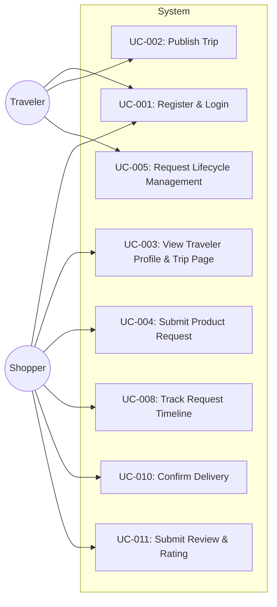

# Use Case Specifications

> Spesifikasi use case formal untuk setiap aktor dan fitur utama untuk Phase 1.

## Use Case Diagram Specification

Rincian interaksi aktor dan sistem untuk **My Trip My Titipan** Phase 1 MVP dibagi berdasarkan peran:

* 👥 **[Traveler Use Cases](traveler/)**: Prosedur registrasi trip, review request, sourcing/pembelian barang, dan pengiriman barang.
  * [Create Trip](traveler/create-trip.md) — UC-002: Publish Trip.
  * [Manage Request](traveler/manage-request.md) — UC-005: Request Lifecycle Management.
* 👥 **[Shopper Use Cases](shopper/)**: Prosedur pengajuan request barang, pelacakan timeline, konfirmasi penerimaan, dan ulasan.
  * [Submit Request](shopper/submit-request.md) — UC-004: Submit Product Request.
  * [Confirm Delivery](shopper/confirm-delivery.md) — UC-010: Confirm Delivery & Feedback.

## Use Case Index

| ID | Use Case | Primary Actor | Priority | Status | Source Link |
| :--- | :--- | :--- | :--- | :--- | :--- |
| **UC-001** | Register & Login | Traveler, Shopper | Must Have | Approved | [Traveler Specs](traveler/manage-request.md) / [Shopper Specs](shopper/submit-request.md) |
| **UC-002** | Publish Trip | Traveler | Must Have | Approved | [Create Trip Specs](traveler/create-trip.md) |
| **UC-003** | View traveler Page | Shopper | Must Have | Approved | [Submit Request Specs](shopper/submit-request.md) |
| **UC-004** | Submit Request | Shopper | Must Have | Approved | [Submit Request Specs](shopper/submit-request.md) |
| **UC-005** | Request Lifecycle Management | Traveler | Must Have | Approved | [Manage Request Specs](traveler/manage-request.md) |
| **UC-008** | Track Request Timeline | Shopper | Must Have | Approved | [Confirm Delivery Specs](shopper/confirm-delivery.md) |
| **UC-010** | Confirm Delivery | Shopper | Must Have | Approved | [Confirm Delivery Specs](shopper/confirm-delivery.md) |
| **UC-011** | Submit Review & Rating | Shopper | Must Have | Approved | [Confirm Delivery Specs](shopper/confirm-delivery.md) |
