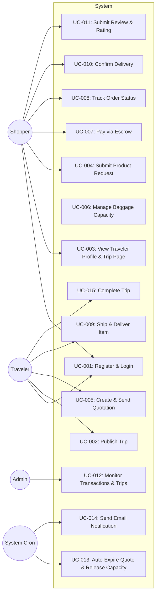

# Use Cases

> Spesifikasi use case formal untuk setiap fitur utama.

## Use Case Diagram Specification

Rincian interaksi aktor dan sistem untuk **My Trip My Titipan** MVP dapat diakses di:

👉 **[Detailed Use Case Specifications](use-case-specifications.md)**

## Use Case Index

| ID | Use Case | Primary Actor | Priority | Status |
| :--- | :--- | :--- | :--- | :--- |
| **UC-001** | [Register & Login](use-case-specifications.md#uc-001-register--login) | Traveler, Shopper | Must Have | Done |
| **UC-002** | [Publish Trip](use-case-specifications.md#uc-002-publish-trip) | Traveler | Must Have | Done |
| **UC-003** | [View Traveler Profile & Trip Page](use-case-specifications.md#uc-003-view-traveler-profile--trip-page) | Shopper | Must Have | Done |
| **UC-004** | [Submit Product Request](use-case-specifications.md#uc-004-submit-product-request) | Shopper | Must Have | Done |
| **UC-005** | [Create & Send Quotation](use-case-specifications.md#uc-005-create--send-quotation) | Traveler | Must Have | Done |
| **UC-006** | [Manage Baggage Capacity](use-case-specifications.md#uc-006-manage-baggage-capacity-reserve--lock) | System | Must Have | Done |
| **UC-007** | [Pay via Escrow](use-case-specifications.md#uc-007-pay-via-escrow) | Shopper | Must Have | Done |
| **UC-008** | [Track Order Status](use-case-specifications.md#uc-008-track-order-status) | Shopper, Traveler | Must Have | Done |
| **UC-009** | [Ship & Deliver Item](use-case-specifications.md#uc-009-ship--deliver-item) | Traveler | Must Have | Done |
| **UC-010** | [Confirm Delivery](use-case-specifications.md#uc-010-confirm-delivery) | Shopper | Must Have | Done |
| **UC-011** | [Submit Review & Rating](use-case-specifications.md#uc-011-submit-review--rating) | Shopper | Must Have | Done |
| **UC-012** | [Monitor Transactions & Trips](use-case-specifications.md#uc-012-monitor-transactions--trips) | Admin | Must Have | Done |
| **UC-013** | [Auto-Expire Quote & Release Capacity](use-case-specifications.md#uc-013-auto-expire-quote--release-capacity) | System | Must Have | Done |
| **UC-014** | [Send Email Notification](use-case-specifications.md#uc-014-send-email-notification) | System | Must Have | Done |
| **UC-015** | [Complete Trip](use-case-specifications.md#uc-015-complete-trip) | Traveler | Must Have | Done |
