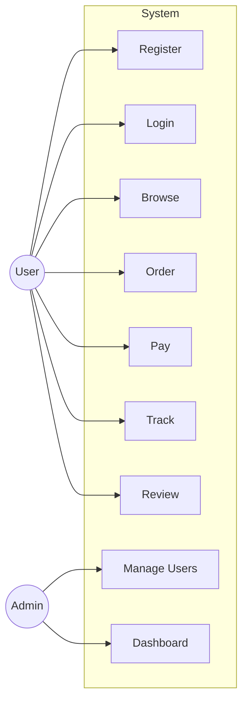

# Use Cases

> Spesifikasi use case formal untuk setiap fitur utama.

## Template

Setiap use case mengikuti format standard:

- **Use Case ID**: UC-[Number]
- **Actor(s)**: Siapa yang melakukan
- **Preconditions**: Kondisi awal
- **Main Flow**: Langkah-langkah utama
- **Alternative Flows**: Skenario alternatif
- **Exception Flows**: Penanganan error
- **Postconditions**: Kondisi akhir

## Use Case Diagram

## Use Case Index

| ID | Use Case | Actor | Priority | Status |
|----|----------|-------|----------|--------|
| UC-001 | [Authentication](uc-001-authentication.md) | User | Must | 📝 Draft |
| UC-002 | Browse & Search | User | Must | ⬜ Todo |
| UC-003 | Place Order | User | Must | ⬜ Todo |
| UC-004 | Payment | User | Must | ⬜ Todo |
| UC-005 | Track Order | User | Should | ⬜ Todo |
| UC-006 | Review & Rating | User | Should | ⬜ Todo |
| UC-007 | Admin Dashboard | Admin | Must | ⬜ Todo |

---

> **Input dari**: [User Stories](../user-stories/), [PRD](../prd.md)
> **Output ke**: [Sequence Diagrams](../../04-technical/sequence-diagrams/), [API Specification](../../04-technical/api-specification/)
