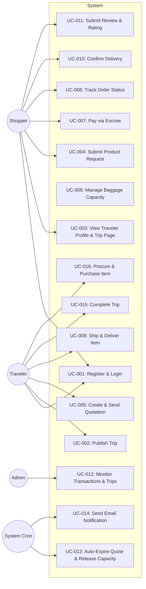

# Use Case Specifications

> Spesifikasi use case formal untuk setiap aktor dan fitur utama.

## Use Case Diagram Specification

Rincian interaksi aktor dan sistem untuk **My Trip My Titipan** MVP dibagi berdasarkan peran:

* 👥 **[Traveler Use Cases](traveler-usecases.md)**: Prosedur registrasi trip, pembuatan quotation, pembelian barang, pengiriman barang, dan penyelesaian trip.
* 👥 **[Shopper Use Cases](shopper-usecases.md)**: Prosedur pengajuan request barang, pembayaran escrow, pelacakan order, konfirmasi penerimaan, dan ulasan.
* ⚙️ **[Admin & System Use Cases](admin-usecases.md)**: Monitoring transaksi, penanganan status kedaluwarsa otomatis, manajemen kapasitas bagasi, dan notifikasi.

## Use Case Index

| ID | Use Case | Primary Actor | Priority | Status | Source Link |
| :--- | :--- | :--- | :--- | :--- | :--- |
| **UC-001** | Register & Login | Traveler, Shopper | Must Have | Done | [Traveler Specs](traveler-usecases.md#uc-001-register--login-traveler-role) / [Shopper Specs](shopper-usecases.md#uc-001-register--login-shopper-role) |
| **UC-002** | Publish Trip | Traveler | Must Have | Done | [Traveler Specs](traveler-usecases.md#uc-002-publish-trip) |
| **UC-003** | View Traveler Profile & Trip Page | Shopper | Must Have | Done | [Shopper Specs](shopper-usecases.md#uc-003-view-traveler-profile--trip-page) |
| **UC-004** | Submit Product Request | Shopper | Must Have | Done | [Shopper Specs](shopper-usecases.md#uc-004-submit-product-request) |
| **UC-005** | Create & Send Quotation | Traveler | Must Have | Done | [Traveler Specs](traveler-usecases.md#uc-005-create--send-quotation) |
| **UC-006** | Manage Baggage Capacity | System | Must Have | Done | [Admin/System Specs](admin-usecases.md#uc-006-manage-baggage-capacity-reserve--lock) |
| **UC-007** | Pay via Escrow | Shopper | Must Have | Done | [Shopper Specs](shopper-usecases.md#uc-007-pay-via-escrow) |
| **UC-008** | Track Order Status | Shopper | Must Have | Done | [Shopper Specs](shopper-usecases.md#uc-008-track-order-status) |
| **UC-009** | Ship & Deliver Item | Traveler | Must Have | Done | [Traveler Specs](traveler-usecases.md#uc-009-ship--deliver-item) |
| **UC-010** | Confirm Delivery | Shopper | Must Have | Done | [Shopper Specs](shopper-usecases.md#uc-010-confirm-delivery) |
| **UC-011** | Submit Review & Rating | Shopper | Must Have | Done | [Shopper Specs](shopper-usecases.md#uc-011-submit-review--rating) |
| **UC-012** | Monitor Transactions & Trips | Admin | Must Have | Done | [Admin/System Specs](admin-usecases.md#uc-012-monitor-transactions--trips) |
| **UC-013** | Auto-Expire Quote & Release Capacity | System | Must Have | Done | [Admin/System Specs](admin-usecases.md#uc-013-auto-expire-quote--release-capacity) |
| **UC-014** | Send Email Notification | System | Must Have | Done | [Admin/System Specs](admin-usecases.md#uc-014-send-notification) |
| **UC-015** | Complete Trip | Traveler | Must Have | Done | [Traveler Specs](traveler-usecases.md#uc-015-complete-trip) |
| **UC-016** | Procure & Purchase Item | Traveler | Must Have | Done | [Traveler Specs](traveler-usecases.md#uc-016-procure--purchase-item) |
