# Global Navigation Map & Information Architecture

> **Status**: 📝 Draft **Last Updated**: 2026-06-14

This document defines the application information architecture, layout grids, permission boundaries, and navigation maps for the **My Trip My Titipan** MVP.

---

## 1. Global Layout Structures

### A. Mobile Web Frame (Shopper & Traveler Context)
* **Header Bar:** Brand logo (MyTrip-MyTitipan), User Avatar trigger (opens dropdown with Profile Link & Logout CTA), and active role switch selector (Switch to Traveler / Switch to Shopper).
* **Footer Navigation Tabs:** Persistent bottom tab bar displayed on all authenticated shopper/traveler dashboards.
  * *Shopper Mode Tab Bar:*
    * Tab 1: **Explore** (Directs to public route or helper instructions on MVP).
    * Tab 2: **My Requests** (Directs to `SCR-004: Shopper Dashboard`).
    * Tab 3: **Profile** (Directs to user details).
  * *Traveler Mode Tab Bar:*
    * Tab 1: **Trip Planner** (Directs to `SCR-006: Traveler Dashboard`).
    * Tab 2: **Create Trip** (Directs to `SCR-007: Create Trip Form`).
    * Tab 3: **Profile** (Directs to traveler info).

### B. Desktop Panel Layout (Admin Context)
* **Sidebar Menu:** Persistent left-hand sidebar containing links:
  * Link 1: **Dashboard Overview** (`SCR-012`).
  * Link 2: **Open Disputes** (`SCR-013`).
  * Link 3: **Escrow Ledger Logs**.
* **Header Utility:** Admin name and Logout button.

---

## 2. Route & Access Boundaries

To protect user safety and simplify checkout transitions, the router enforces three access controls:

```mermaid
graph TD
    G1[Guest / Public Access] --> R1[SCR-002: Trip Landing Page]
    G1 --> R2[SCR-001: Login / Register]
    
    A1[Shopper Authenticated Route] --> R3[SCR-003: Product Request Form]
    A1 --> R4[SCR-004: Shopper Dashboard]
    A1 --> R5[SCR-005: Quote & Checkout Page]
    A1 --> R6[SCR-011: Review Submission]
    
    T1[Traveler Authenticated Route] --> R7[SCR-006: Traveler Dashboard]
    T1 --> R8[SCR-007: Create Trip Form]
    T1 --> R9[SCR-008: Trip Share Modal]
    T1 --> R10[SCR-009: Request Review Screen]
    T1 --> R11[SCR-010: Traveler Order Details]
    
    AD1[Admin Authenticated Route] --> R12[SCR-012: Admin Dashboard]
    AD1 --> R13[SCR-013: Admin Dispute Manager]

    style G1 fill:#e1f5fe,stroke:#01579b,stroke-width:2px
    style A1 fill:#e8f5e9,stroke:#1b5e20,stroke-width:2px
    style T1 fill:#e8f5e9,stroke:#1b5e20,stroke-width:2px
    style AD1 fill:#fff9c4,stroke:#f57f17,stroke-width:2px
```

* **Guest Mode:**
  * Public users can visit `SCR-002` (Trip Landing Page) and `SCR-001` (Login/Register).
  * If a guest clicks "Request Item" on `SCR-002`, the form details are cached in session state, and the router redirects to `SCR-001` for registration.
* **Auth Guards (User Roles):**
  * Accessing screens `SCR-003` to `SCR-011` requires active user session cookies.
  * A traveler trying to request an item on their own trip link is blocked at route level (`shopper.id != traveler.id`).
* **Admin Guard:**
  * Screens `SCR-012` and `SCR-013` require explicit administrator credentials. Users with standard shopper/traveler privileges are redirected to standard dashboards on request.
