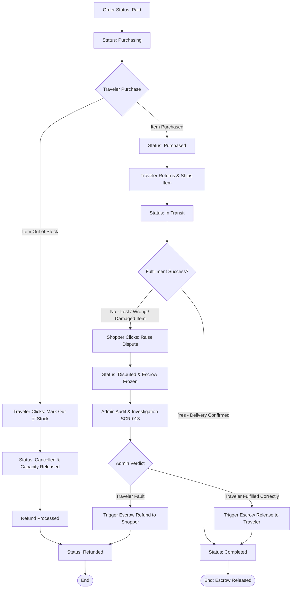

# Exception and Dispute Flows

This document details the step-by-step UX flows, transition triggers, and system mechanics for handling operational errors, user cancellations, capacity releases, and escrow disputes in the **My Trip My Titipan** MVP.

---

## 1. Pre-Quote & Pre-Payment Exceptions

These exceptions occur before the shopper secures the transaction with escrow funds.

### Scenario A: Traveler Declines Request (Pre-Quote)

1. **Trigger**: Traveler receives a new request but chooses not to accept it (e.g., incorrect item info, out-of-route, too heavy).
2. **Action**: Traveler clicks **"Decline Request"** on `SCR-009`.
3. **System Logic**:
   - Order status transitions: `Requested` → `Cancelled`.
   - Baggage capacity is untouched (no reservation had occurred yet).
4. **UX Result**: Shopper receives a notification: *"Budi has declined your request. Your request is now cancelled."* Shopper dashboard `SCR-004` moves the request to the "History" section.

### Scenario B: Pre-Payment Quote Expiry (24h Window)

1. **Trigger**: Traveler sent a quote, initiating a temporary baggage capacity reservation, but the shopper does not pay within the 24-hour limit, or the payment gateway transaction fails/expires.
2. **Action**: Automated cron job detects `payment_window_closed` (created_at + 24 hours), or payment gateway callback reports checkout failed/expired status.
3. **System Logic**:
   - Order status transitions: `Quoted` or `Payment Pending` → `Expired`.
   - Capacity release: Reserved weight is immediately released and added back to `trip.available_capacity`.
4. **UX Result**: Shopper receives a notification: *"Your quote for Tokyo items has expired. Baggage capacity has been released."* Shopper Dashboard update removes the active checkout option.

---

## 2. Post-Payment Exceptions (Capital & Fulfillment Risks)

These exceptions occur after the shopper's payment is secured in escrow. These require operational intervention or structured actions to protect user trust.

### Scenario C: Item Out-of-Stock / Unavailable

1. **Trigger**: Traveler is abroad (in `Purchasing` state), attempts to purchase the item, but discovers it is completely unavailable or sold out.
2. **Action**: Traveler clicks **"Mark Out of Stock"** on `SCR-010`.
3. **System Logic**:
   - Order status transitions: `Purchasing` (or `Paid`) → `Cancelled` → `Refunded`.
   - Baggage capacity is unlocked: Weight is released back to `trip.available_capacity`.
   - Automated Refund Queue: System triggers an automated escrow refund process via Xendit/Midtrans.
4. **UX Result**:
   - **Shopper**: Receives alert: *"Budi reported that the Tokyo item is out of stock. Your refund has been initiated."*
   - **Admin**: Receives log confirmation of successful refund transaction.

### Scenario D: Traveler Cancels Trip or Becomes Unresponsive

1. **Trigger**: Traveler cancels their flight or fails to communicate/update status after the item has been marked `Paid`.
2. **Action**: Shopper triggers a ticket or waits until 7 days post-arrival date, then escalates via customer support, or clicks **"Raise Dispute"** on `SCR-004`.
3. **System Logic**:
   - Order status transitions: `Paid`, `Purchasing`, or `Purchased` → `Disputed`.
4. **UX Result**: Admin reviews communications and flight cancellation proof. Admin triggers manual refund to shopper, transitioning status to `Cancelled` → `Refunded` and releasing locked capacity.

---

## 3. Post-Shipment Disputes

Disputes raised after domestic shipping has initiated.

### Scenario E: Non-Delivery / Lost Package

1. **Trigger**: Traveler entered tracking AWB, status is `In Transit`, but shopper claims package never arrived after a reasonable timeline.
2. **Action**: Shopper clicks **"Raise Dispute"** on `SCR-004`.
3. **System Logic**:
   - Escrow freeze: The 7-day auto-release timer is immediately suspended.
   - Order status transitions: `In Transit` → `Disputed`.
4. **Investigation Flow (Admin)**:
   - Admin reviews the courier service APIs using the entered AWB tracking number.
   - If Courier reports **"Lost"**: Admin refunds Shopper (`Disputed` → `Cancelled`).
   - If Courier reports **"Delivered"**: Admin requests delivery signature. If verified, Admin releases payout to Traveler (`Disputed` → `Completed`).

### Scenario F: Damaged / Incorrect Item

1. **Trigger**: Shopper receives the package, but the item is broken, counterfeit, or incorrect.
2. **Action**: Shopper clicks **"Raise Dispute"** on `SCR-004` instead of "Confirm Receipt", and uploads photo evidence.
3. **System Logic**:
   - Escrow freeze: Suspends auto-release timer.
   - Order status transitions: `In Transit` or `Delivered` → `Disputed`.
4. **Investigation Flow (Admin)**:
   - Admin opens Dispute Manager `SCR-013` and checks:
     1. Shopper photo proof of damaged/wrong item.
     2. Traveler purchase receipt photo (if uploaded) and shipping package details.
   - **Resolution 1 (Traveler Fault)**: Wrong item or poor packaging. Admin refunds Shopper. Traveler receives no payout.
   - **Resolution 2 (Courier/Shopper Fault)**: Packaging was secure, damage occurred due to courier handling, or shopper claims are invalid. Admin releases funds to Traveler.

---

## 4. Exception Flows Diagrams

### Post-Payment & Dispute Lifecycle Flowchart

---

## 5. Capacity Exceeded & Double Booking Safeguards

To prevent overbooking when multiple shopper requests are received concurrently:

1. **Temporary Locking Rule**: When a traveler initiates a quote, the requested item weight is checked against `trip.available_capacity`. If valid, the system temporarily decrements the available capacity.
2. **Concurrent Quote Safeguard**: If multiple shopper quotes are outstanding and one shopper pays—depleting the available capacity—the system automatically:
   - Transitions remaining unpaid quotes to `Cancelled` or alerts travelers.
   - Rejects checkouts for other shoppers with: *"Baggage capacity limit reached. Checkout unavailable."*