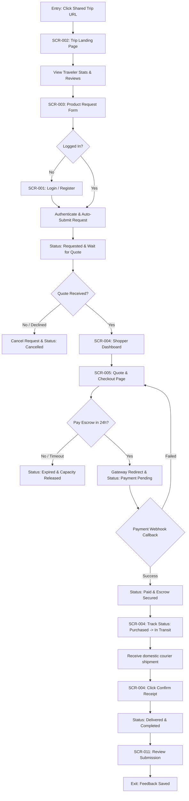

# Shopper UX User Flow Specifications

> **Status**: 📝 Draft **Last Updated**: 2026-06-14

This document defines the step-by-step user interaction flow, navigation entry/exit points, screen inventory mappings, and interface states for the **Shopper** actor (demand side).

---

## 1. Journey Entry & Exit Points

* **Entry Point (Input):** Shopper clicks Budi's shared traveler trip link (e.g., `mytrip.com/t/budi-tokyo-24`) posted on social media or messaging platforms, landing on the public Trip details screen.
* **Exit Point (Output):** Shopper receives domestic shipment package, confirms receipt on the dashboard, and submits feedback reviews.

---

## 2. Screen Mapping & Step-by-Step Flow

Every shopper interaction maps to a unique Screen ID from the design inventory:

### Flow Breakdown & Screen Actions:
1. **Trip Discovery (`SCR-002`):** Shopper views Budi's route dates, available suitcase capacity limit bar, and ratings list. Clicks "Request Item".
2. **Item Specification (`SCR-003`):** Shopper enters Item Name, reference links, budget currency in IDR, and uploads a product reference image. Clicks "Submit Request".
   * *Authentication Guard:* If not logged in, system redirects shopper to `SCR-001` to login via Google SSO or Email-OTP, then automatically creates request.
3. **Shopper Panel Tracker (`SCR-004`):** Shopper views active requests list. Active quotes displays countdown timers. Clicks "Review Quote".
4. **Quotation & Checkout (`SCR-005`):** Shopper reviews Item Price + Jastip Fee pricing breakdown. Selects payment method (Virtual Account or GoPay) and clicks "Pay Now".
5. **Review Submission (`SCR-011`):** Shopper clicks stars (1 to 5) and enters review text feedback. Clicks "Submit Review".

---

## 3. Separation of Business Rules vs. UX Behaviors

To guide development backend/frontend boundaries, logical rules are isolated from interface widgets:

### A. Expiry of Unpaid Quotations
* **Business Rule:**
  * Quotes must automatically expire and release suitcase weight back to traveler availability after 24 hours.
* **UX Behavior:**
  * Shopper Dashboard (`SCR-004`) and Checkout Page (`SCR-005`) display a real-time countdown timer: `Review Quote & Pay (Expires in 14h 23m)`.
  * System sends a reminder notification email to shopper 2 hours prior to expiration.

### B. Payment Success & Escrow Locking
* **Business Rule:**
  * 100% of quote total must fund the platform escrow. Virtual capacity reserves are converted to locked capacity upon gateway webhook success callback.
* **UX Behavior:**
  * Payment checkout forms display visual trust badges detailing platform escrow safety guarantees.
  * Successful payment updates order statuses to `Paid` instantly, showing secure badge icons.

---

## 4. Journey State & Exception UX Variations

### A. Empty State (No Active Requests)
* **Visual:** Box illustration icon on `SCR-004`.
* **UX Copy:** *"No active titipan. Once you find a traveler's trip link, you can submit product requests here."*

### B. Sourcing Processing State
* **UX Behavior:** Display processing overlay during virtual account generation: `Generating Virtual Account invoice number...`

### C. Capacity Exceeded Error State
* **UX Behavior:** If trip capacity is depleted, shopper is prevented from requesting items on `SCR-002` (displays red banner: *"Baggage capacity limit reached"* and disables CTA). If checkout is active, displays error banner: *"Luggage capacity exceeded. Transaction cancelled."*

### D. Permission Denied Block State
* **UX Behavior:** If guest tries to access `SCR-004`, router redirects to `SCR-001` with error message: *"Please login to view your shopper dashboard."*
