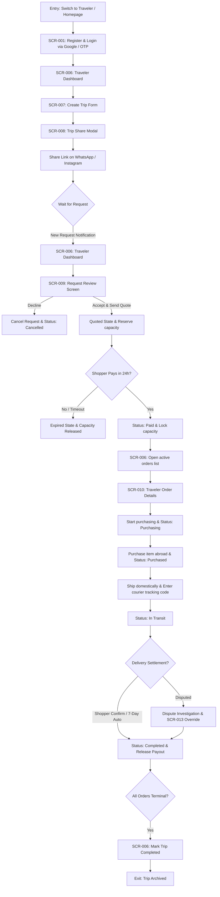

# Traveler UX User Flow Specifications

> **Status**: 📝 Draft **Last Updated**: 2026-06-14

This document defines the step-by-step user interaction flow, navigation entry/exit points, screen inventory mappings, and interface states for the **Traveler** actor (supply side).

---

## 1. Journey Entry & Exit Points

* **Entry Point (Input):** Traveler accesses the platform homepage URL via mobile web browser or clicks "Switch to Traveler" on their active dashboard header bar.
* **Exit Point (Output):** Traveler confirms all active trip orders are completed, withdraws funds, and archives the trip record.

---

## 2. Screen Mapping & Step-by-Step Flow

Every traveler interaction maps to a unique Screen ID from the design inventory:



### Flow Breakdown & Screen Actions:
1. **Authentication (`SCR-001`):** Traveler completes login.
2. **Dashboard Overview (`SCR-006`):** Traveler checks active wallet balance and lists active trips. Clicks "Publish New Trip".
3. **Trip Setup Form (`SCR-007`):** Traveler enters departure/arrival airport codes, travel schedule dates, and available suitcase weight limit (kg). Clicks "Publish Trip".
4. **Link Curation Widget (`SCR-008`):** System displays shareable URL wrapper. Traveler clicks "Copy Link" or WhatsApp/Instagram share CTAs.
5. **Request Review Panel (`SCR-009`):** Traveler opens incoming shopper product requests. Reviews photo and willing-to-pay budget. Proposes Item Price, Jastip Fee, and item weight. Clicks "Send Quote".
6. **Fulfillment details Tracker (`SCR-010`):** Traveler views paid order profiles. Selects "Start Sourcing" (sets status to `PURCHASING`), uploads receipt and clicks "Mark as Purchased" (sets status to `PURCHASED`), inputs domestic Courier and tracking AWB number, then clicks "Submit Tracking" (sets status to `IN_TRANSIT`).

---

## 3. Separation of Business Rules vs. UX Behaviors

To guide development backend/frontend boundaries, logical rules are isolated from interface widgets:

### A. Baggage Capacity Reservation
* **Business Rule:**
  * When traveler sends quote: system subtracts estimated weight from available capacity and adds to reserved capacity (starts a 24-hour timer).
* **UX Behavior:**
  * Traveler sees dynamic suitcase capacity occupancy metrics on `SCR-006`.
  * If estimated weight exceeds remaining available capacity, the quote submission CTA button on `SCR-009` is disabled, displaying: *"Insufficient baggage capacity on this trip."*

### B. Escrow Payout Settlement
* **Business Rule:**
  * Escrow funds are released to traveler's bank account after shopper manual delivery confirmation or a 7-day auto-delivery timer.
* **UX Behavior:**
  * Traveler Dashboard (`SCR-006`) displays updated withdrawable Wallet balance count.
  * Traveler Order details (`SCR-010`) displays green locked badge indicators stating: *"Escrow Secured: Shopper funds are locked. Payout is guaranteed."*

---

## 4. Trip Management Dashboard & Lifecycle

### A. Trip Dashboard View Structure (`SCR-006`)
Travelers manage their inventory via five defined dashboard lists:
1. **Active Trips:** Current trips with open available capacity.
2. **Requests:** Shopper product request submissions awaiting review (`Requested` status).
3. **Orders:** Active paid orders in the fulfillment pipeline (`Paid`, `Purchasing`, `Purchased`, `In Transit`).
4. **Earnings:** Breakdown of completed payouts and active escrow holdings.
5. **Completed Trips:** Archive of completed/expired historical journeys.

### B. Trip Lifecycle States
A traveler's trip progresses through four lifecycle states:
```
[Draft] -> [Published] -> [Expired] -> [Completed]
```
* **Draft:** Trip form is filled but not submitted (saved locally).
* **Published:** Active trip link, open to shopper request submissions.
* **Expired:** Travel dates have passed; trip capacity is retired, and requests are closed.
* **Completed:** All associated orders are finalized (`Completed`, `Expired`, `Cancelled`, or `Refunded`), and traveler archives the trip.

---

## 5. Journey State & Exception UX Variations

### A. Empty State (No Trips published)
* **Visual:** Suitcase icon illustration on `SCR-006`.
* **UX Copy:** *"Planning a journey? Publish your trip and share the link to start receiving product requests."*
* **CTA Button:** *"Create Trip"* (redirects to `SCR-007`).

### B. Empty State (No requests received)
* **Visual:** Empty inbox card.
* **UX Copy:** *"No requests yet. Copy your trip link and share it on Instagram or WhatsApp to attract shoppers!"*
* **CTA Button:** *"Copy Trip Link"*.

### C. Sourcing Loading State
* **UX Behavior:** Disable Mark as Purchased button and show progress spinner while thumbnail image upload is running.

### D. Schedule Error State (Past Dates)
* **UX Behavior:** Highlight date picker fields in red on `SCR-007` with warning banner: *"Departure/Return dates cannot be in the past."*

### E. Permission Denied Block State
* **UX Behavior:** If guest tries to access `SCR-006`, the router intercepts request, stores the target page URL, redirects to `SCR-001` with banner: *"Please login to manage your traveler dashboard."*