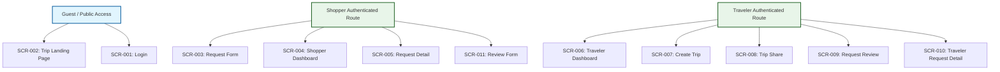

# Global Navigation Map & Information Architecture

> **Status**: 📝 Draft **Last Updated**: 2026-06-14

This document defines the application information architecture, layout grids, permission boundaries, and navigation maps for the **My Trip My Titipan** MVP.

---

## 1. Global Layout Structures

### A. Mobile Web Frame (Shopper & Traveler Context)

- **Header Bar:** Brand logo (MyTrip-MyTitipan), User Avatar trigger (opens dropdown with Profile Link & Logout CTA), and active role switch selector (Switch to Traveler / Switch to Shopper).
- **Footer Navigation Tabs:** Persistent bottom tab bar displayed on all authenticated shopper/traveler dashboards.
  - *Shopper Mode Tab Bar:*
    - Tab 1: **Home** (Directs to `SCR-004: Shopper Dashboard` showing My Requests).
    - Tab 2: **Profile** (Directs to user details).
  - *Traveler Mode Tab Bar:*
    - Tab 1: **Home** (Directs to `SCR-006: Traveler Dashboard` showing My Trips & Requests).
    - Tab 2: **Profile** (Directs to traveler info).
  - *Floating CTA (Traveler Mode Only):*
    - **+ Create Trip** (Floating CTA on Traveler Dashboard, redirects to `SCR-007: Create Trip`).

---

## 2. Route & Access Boundaries

To protect user safety and simplify checkout transitions, the router enforces access controls:

- **Guest Mode:**
  - Public users can visit `SCR-002` (Trip Landing Page) and `SCR-001` (Login).
  - If a guest clicks "Request Item" on `SCR-002`, the form details are cached in session state, and the router redirects to `SCR-001` for registration.
- **Auth Guards (User Roles):**
  - Accessing screens `SCR-003` to `SCR-011` requires active user session cookies.
  - A traveler trying to request an item on their own trip link is blocked at route level (`shopper.id != traveler.id`).