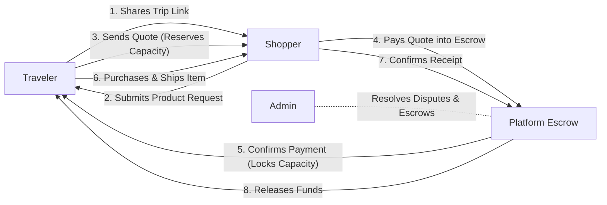
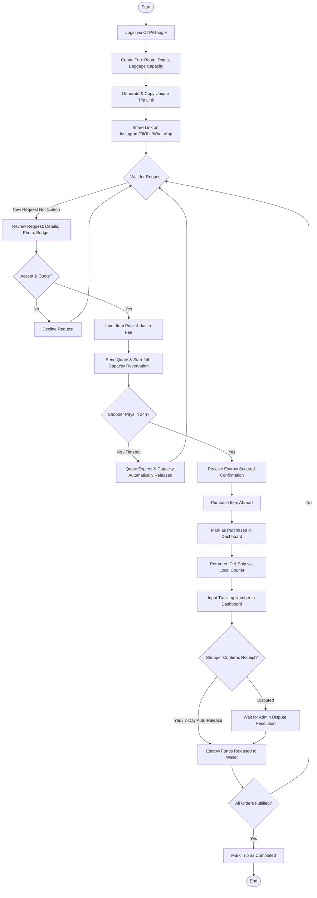
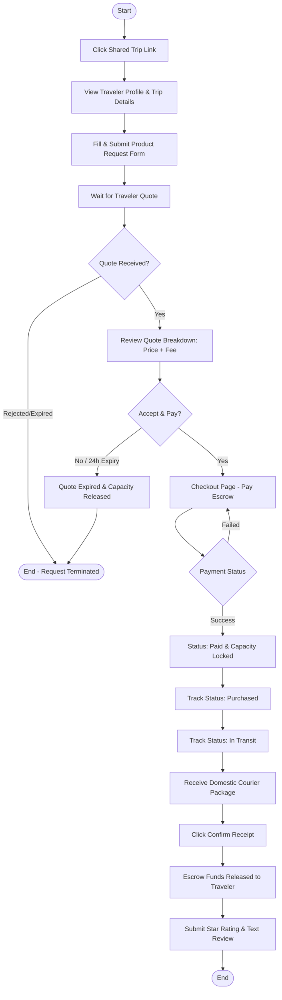
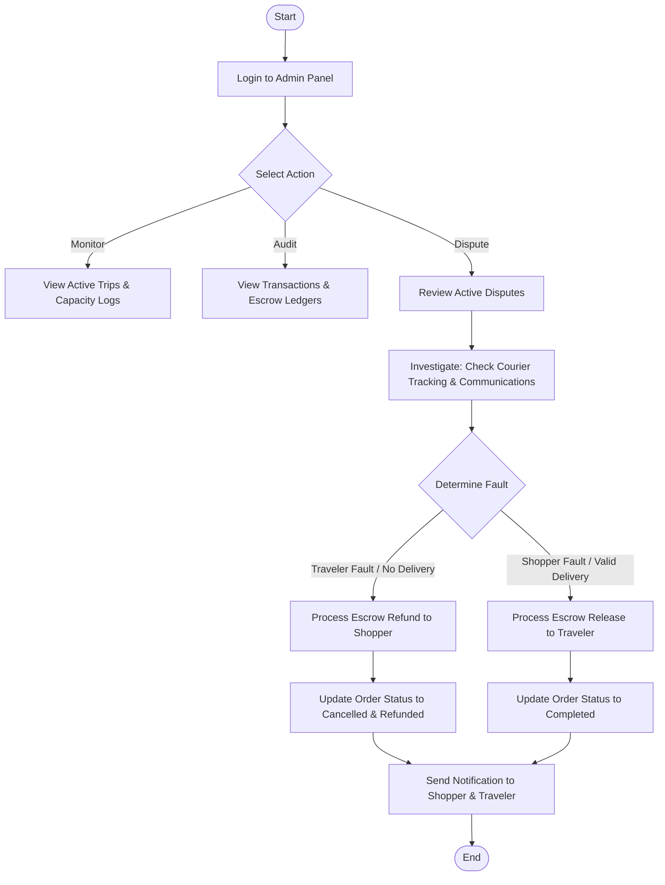
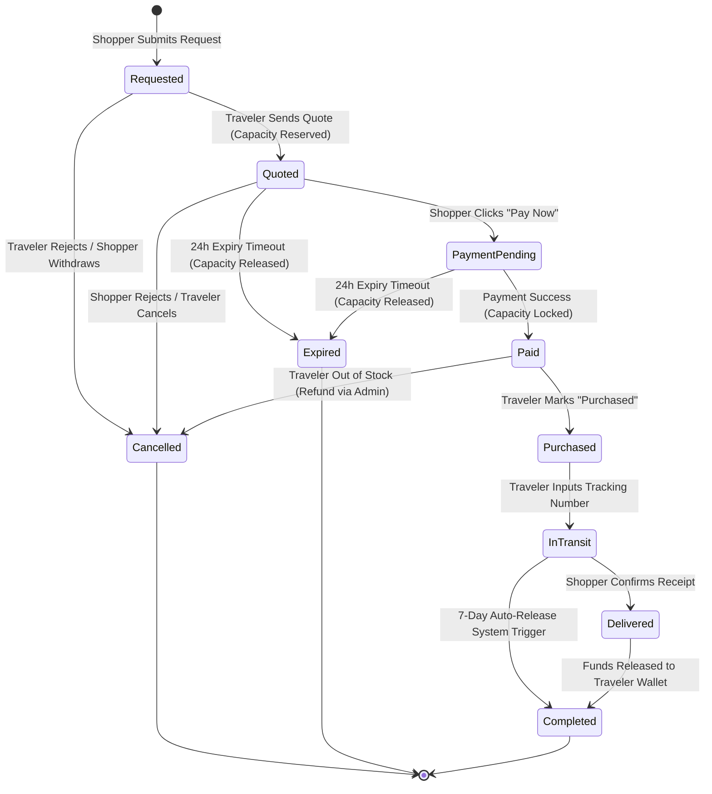

# UX User Flow (MVP)

This document translates the product requirements, user journeys, and core flows of **My Trip My Titipan** into detailed UX user flows. It defines the step-by-step navigation, screen inventory, and status transition mappings for the MVP.

---

## User Flow Overview

The MVP user flow connects three primary actors in a single, trust-driven transaction lifecycle. To remain within the 3-month launch window, all workflows focus strictly on the mobile-first request-and-fulfillment loop, using external sharing channels for discovery and relying on integrated Escrow payments for secure trust.

### Primary Actors

*   **Traveler**: The supply provider. They set up trips, publish baggage capacity, share links, review incoming shopper requests, send quotes, purchase products abroad using their own funds, ship items domestically, and receive payout from escrow.
*   **Shopper**: The demand creator. They land on the traveler's public page via shared links, view traveler profiles and ratings, submit structured product requests, pay quotes into escrow, track order statuses, and confirm delivery to trigger the traveler's payout.
*   **Admin**: The platform moderator. They supervise active trips and transactions, audit escrow balances, investigate dispute claims (e.g., damaged items or unresponsive travelers), and handle manual refund/payout actions.

---

## Traveler User Flow

The Traveler flow focuses on publishing baggage capacity and fulfilling shopper requests. Travelers must manage their luggage constraints and purchase items out-of-pocket before shipping them back.

### Step-by-Step Flow

1.  **Login**: The traveler authenticates through a mobile-first screen using Google or OTP.
2.  **Create Trip**: The traveler inputs trip details: departure airport, arrival airport, travel dates, and maximum baggage capacity (in kilograms).
3.  **Share Link**: The system generates a unique, shareable URL (e.g., `mytrip.com/t/budi-tokyo-24`). The traveler copies and posts this link in their social media bio or story.
4.  **Review Request**: The traveler is notified of a shopper request. They review item details, images, external URLs, requested quantities, and estimated weights.
5.  **Send Quote**: The traveler enters the actual purchase price of the item and their desired service fee (Jastip Fee).
6.  **Capacity Reservation**: Upon sending the quote, the system automatically checks and temporarily reserves baggage capacity (estimated item weight) for 24 hours.
7.  **Track Orders**: The traveler accesses their dashboard to monitor active requests and order stages.
8.  **Mark Purchased**: Once the traveler purchases the item abroad, they mark the item as "Purchased" in their dashboard.
9.  **Ship Item**: Upon returning to Indonesia, the traveler ships the item manually via a domestic courier (JNE/GoSend) and inputs the tracking AWB number.
10. **Receive Payout**: The escrow funds are released to the traveler's wallet once the shopper confirms delivery or after the 7-day auto-release window.
11. **Complete Trip**: Once all active orders associated with a trip are completed, the traveler archives the trip.

---

## Shopper User Flow

The Shopper flow captures demand and secures the transaction using an escrow protection layer, removing the risk of payment fraud.

### Step-by-Step Flow

1.  **Open Shared Link**: The shopper clicks a shared link on social media and is redirected to the traveler's public trip landing page.
2.  **View Traveler Profile**: The shopper reviews the traveler's profile page containing completed trips count, completed orders count, star rating, and historical shopper reviews.
3.  **Submit Request**: The shopper fills out a structured request form with the product name, reference link, photo upload, quantity, maximum budget, and estimated weight.
4.  **Receive Quote**: The shopper receives a notification that the traveler has quoted the request, displaying the item cost and jastip fee breakdown.
5.  **Checkout**: The shopper reviews the total price and proceeds to the checkout page.
6.  **Escrow Payment**: The shopper pays the total amount via virtual accounts or e-wallets (Xendit/Midtrans gateway). The payment must be completed within 24 hours. Once paid, the capacity reservation is locked.
7.  **Track Order Status**: The shopper monitors status updates (`Paid` → `Purchased` → `In Transit` → `Delivered`) on their personal dashboard.
8.  **Confirm Receipt**: Upon receiving the package, the shopper confirms the delivery in the app.
9.  **Leave Review**: The shopper leaves a 1–5 star rating and text feedback for the traveler.

---

## Admin User Flow

The Admin flow is designed for platform operators to monitor transactions and handle exceptions.

### Step-by-Step Flow

1.  **View Active Trips**: The admin reviews published trips, destination routes, dates, and active luggage capacity utilization.
2.  **View Transactions**: The admin tracks the escrow ledger, total payments made, and current status of each transaction.
3.  **Handle Escrow Issues**: The admin views disputed orders where shoppers claim non-delivery, damaged items, or where travelers are unresponsive.
4.  **Handle Refund Cases**: The admin triggers manual refunds back to the shopper (if the traveler failed to buy/ship) or releases payouts to the traveler (if the shopper received the item but disputed maliciously).
5.  **Monitor Platform Activity**: The admin views high-level transaction volume, match rates, and active user analytics.

---

## Screen Inventory

The following screens are required to support the MVP features for the mobile-first web application:

| Screen ID | Screen Name | Actor(s) | UX Objective & Description | Primary CTAs | Preceding Screen |
| :--- | :--- | :--- | :--- | :--- | :--- |
| **SCR-001** | Login / Register | Traveler, Shopper | Authenticate users using Google or phone OTP. | "Log in with Google", "Send OTP" | Landing / Redirected |
| **SCR-002** | Trip Landing Page | Shopper | Public page displaying traveler profile, reputation metrics (stars, completed orders count), trip routes, dates, and available capacity. | "Request Item" | Clicked Shared Link |
| **SCR-003** | Product Request Form | Shopper | Structured form to submit demand details. | "Submit Request" | SCR-002 |
| **SCR-004** | Shopper Dashboard | Shopper | List active requests, quotes awaiting payment, active orders, and transaction history. | "Review Quote", "Confirm Receipt" | SCR-001 |
| **SCR-005** | Quote Review & Payment | Shopper | Details of the traveler's quote showing cost breakdowns, capacity status, and a payment gateway redirect. | "Pay Now", "Decline Quote" | SCR-004 |
| **SCR-006** | Traveler Dashboard | Traveler | Central page displaying active trips, pending requests, active orders, and wallet balances. | "Create Trip", "Review Request" | SCR-001 |
| **SCR-007** | Create Trip Form | Traveler | Form to set up trip routes, dates, and maximum luggage baggage capacity. | "Publish Trip" | SCR-006 |
| **SCR-008** | Trip Share Screen | Traveler | Post-publish screen presenting the unique shareable link. | "Copy Link", "Share to WhatsApp" | SCR-007 |
| **SCR-009** | Request Review Screen | Traveler | Detailed view of shopper requests allowing travelers to input quote items. | "Send Quote", "Reject Request" | SCR-006 |
| **SCR-010** | Traveler Order Details | Traveler | Order fulfillment screen displaying customer shipping address, item status, and tracking inputs. | "Mark as Purchased", "Submit Tracking" | SCR-006 |
| **SCR-011** | Review Submission | Shopper | Form to rate the traveler and submit text reviews. | "Submit Review" | SCR-004 |
| **SCR-012** | Admin Dashboard | Admin | High-level operations overview displaying system stats and transaction listings. | "Audit Transactions", "View Disputes" | Admin Login |
| **SCR-013** | Admin Dispute Manager | Admin | Detail view of open escrow disputes with manual refund and payout actions. | "Refund Shopper", "Payout Traveler" | SCR-012 |

---

## State Transitions

Transactions move through two distinct lifecycle stages: the **Request Lifecycle** (pre-payment) and the **Fulfillment Lifecycle** (post-payment).

### Transition Rules

*   **Requested**: Shopper has submitted a product request.
*   **Quoted**: Traveler has sent a quote, initiating a 24-hour temporary capacity reservation.
*   **Payment Pending**: Shopper clicks "Pay Now" and enters the payment gateway.
*   **Paid**: Payment is completed successfully. The escrow holds the funds, and the capacity reservation becomes a locked block.
*   **Purchased**: Traveler buys the item abroad and marks it in the dashboard.
*   **In Transit**: Traveler returns to Indonesia, dispatches the item via domestic courier, and enters the tracking number.
*   **Delivered**: Shopper confirms receipt of the item, which automatically triggers the release of escrow funds.
*   **Completed**: Payout is completed to the traveler's balance. This is the final successful state.
*   **Expired**: Quote or payment window times out after 24 hours. The capacity is automatically released back to the trip.
*   **Cancelled**: Request is rejected by the traveler, withdrawn by the shopper before payment, or cancelled due to out-of-stock items post-payment (handled via admin escrow refund).

---

## UX Notes

### Potential User Confusion

> [!NOTE]
> **Capacity Reservation Expiry**: Shoppers may not understand why a quote is no longer available. 
> *   **UX Solution**: Place a clear countdown timer (e.g., "Expires in 14h 23m") on the Quote details page and send a notification warning 2 hours before expiry.
> *   **UX Solution**: Add micro-copy explaining that baggage capacity is limited and cannot be held indefinitely.

> [!IMPORTANT]
> **Out-of-Pocket Purchasing**: Travelers may feel anxious about buying items with their own money.
> *   **UX Solution**: In the Traveler Dashboard, display a prominent lock badge next to "Paid" requests, with micro-copy stating: *"Escrow Secured: Shopper funds are locked by the platform. It is 100% safe to purchase this item."*

> [!WARNING]
> **No In-App Chat**: Users accustomed to traditional social jastip may look for a chat feature.
> *   **UX Solution**: Make form fields comprehensive (supporting product URL, photos, and item descriptions) to eliminate the need for chat. Add helper tooltips to explain: *"Structured requests ensure exact item accuracy and secure pricing."*

### Required Notifications

| Trigger Event | Recipient | Channel | Template Message |
| :--- | :--- | :--- | :--- |
| Shopper submits request | Traveler | Email, Web Push | "New request received for your trip to Tokyo! Review details and send a quote." |
| Traveler sends quote | Shopper | Email, Web Push | "Budi sent you a quote! Pay within 24 hours to secure your baggage capacity." |
| Shopper pays escrow | Traveler | Email, Web Push | "Payment secured! You can now purchase the item during your trip." |
| Traveler marks purchased | Shopper | Web Push | "Great news! Budi has purchased your requested item in Tokyo." |
| Traveler inputs tracking | Shopper | Email, Web Push | "Your package is on its way! Shipped via [Courier] with tracking number [AWB]." |
| Order delivered | Traveler | Web Push | "Shopper confirmed delivery! Funds have been released to your wallet." |
| 24h payment window expires | Shopper & Traveler | Email, Web Push | "Quote expired. The baggage capacity has been released back to the traveler." |

### Error States

*   **Baggage Capacity Full**: If a shopper requests an item whose estimated weight exceeds the traveler's remaining capacity, disable the request button. Display: *"Baggage capacity limit reached. This traveler cannot take additional requests."*
*   **Payment Failure**: If the checkout gateway throws an error, keep the user on the checkout page, display the error message clearly, and provide a "Try Again" button alongside the remaining expiry timer.
*   **Invalid Tracking Number**: When a traveler enters shipping details, validate the format of the tracking number against common patterns for JNE/GoSend. If invalid, highlight the input field in red with: *"Please enter a valid tracking number."*

### Empty States

*   **Traveler Dashboard (Trips Tab)**: When a traveler has no trips, show a suitcase illustration and a prompt: *"Planning a journey? Publish your trip and share the link to start receiving product requests."* with a primary CTA button: *"Create Trip"*.
*   **Traveler Dashboard (Requests Tab)**: When a traveler has a trip but no requests yet, show a status card: *"No requests yet. Copy your trip link and share it on Instagram or WhatsApp to attract shoppers!"* with a CTA button: *"Copy Trip Link"*.
*   **Shopper Dashboard**: When a shopper has no active requests, display: *"No active titipan. Once you find a traveler's trip link, you can submit product requests here."*
*   **Admin Dispute Center**: If there are no open dispute tickets, show a shield checkmark: *"All quiet! No active disputes or escrow investigations at this time."*
