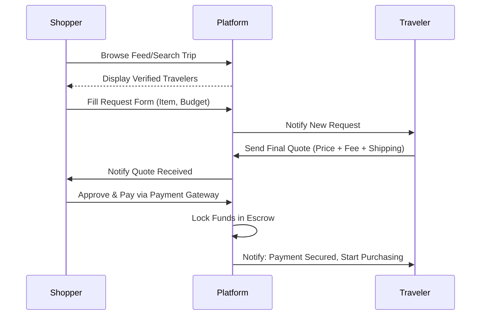
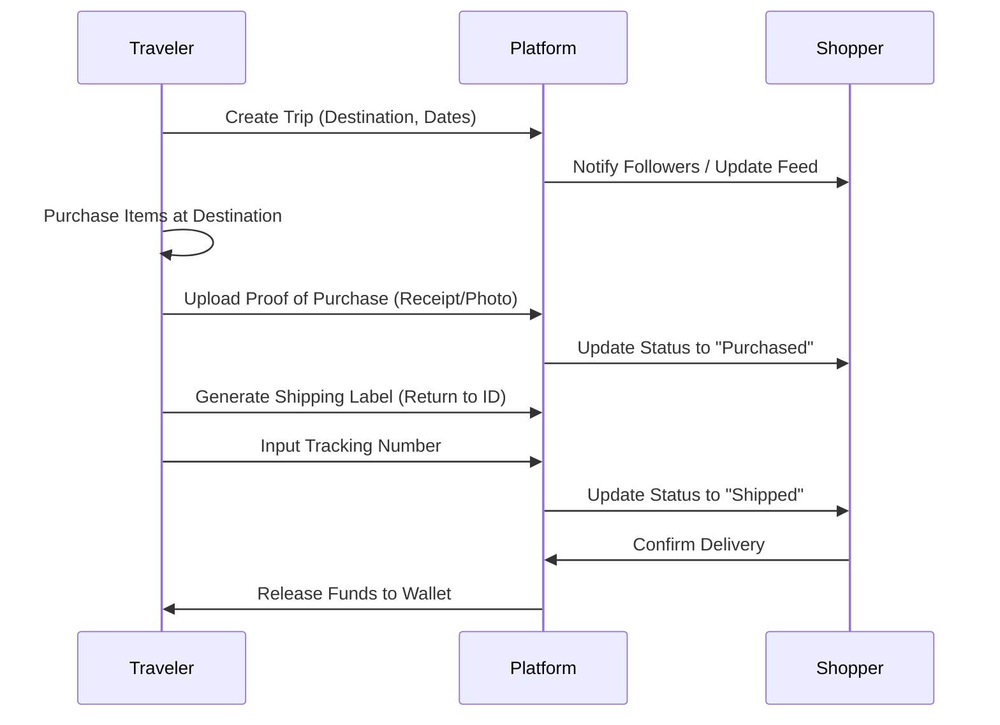

# User Flow

> Diagram alur interaksi pengguna di dalam aplikasi.

## Naming Convention

File: `[flow-name].md` atau `[flow-name].png`

## Flows

| Flow | Description | Status |
|------|-------------|--------|
| Registration Flow | Alur pendaftaran user baru | ⬜ Todo |
| Login Flow | Alur login user | ⬜ Todo |
| Search & Browse Flow | Alur pencarian traveler dan produk | 🚧 In Progress |
| Request-to-Payment Flow | Alur dari Shopper buat request sampai bayar Escrow | ✅ Defined |
| Trip-to-Fulfillment Flow | Alur Traveler buat trip sampai kirim barang | ✅ Defined |
| Profile & Reputation Flow | Alur manajemen profil dan sistem badge | ⬜ Todo |

## Core Flow: Shopper Request-to-Payment

## Core Flow: Traveler Trip-to-Fulfillment

---

> **Input dari**: [User Journey](../../02-product/user-journey.md), [User Persona](../../02-product/user-persona.md)
> **Output ke**: [Wireframes](../wireframes/), [Sequence Diagrams](../../04-technical/sequence-diagrams/)
