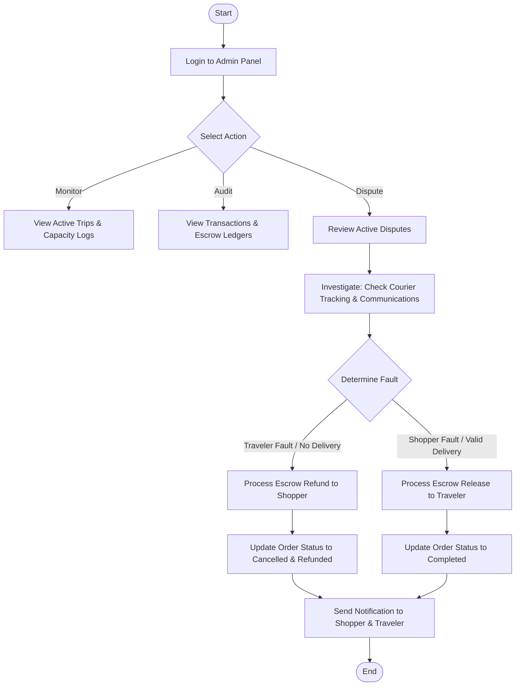

# Admin Flow

This document details the step-by-step user flow, navigation paths, and user experience considerations for the **Admin** actor in the My Trip My Titipan MVP.

---

## 1. Step-by-Step Flow

The Admin flow is designed for platform operators to monitor platform transactions and handle exceptions:

*   **View Active Trips**: The admin reviews published trips, routes, travel dates, and baggage capacity logs.
*   **View Transactions**: The admin monitors the escrow ledger, total payments processed, and status of each transaction.
*   **Handle Escrow Issues (Disputes)**: The admin views open disputes where shoppers claim non-delivery, damaged items, or where travelers are unresponsive.
*   **Handle Refund Cases**: The admin triggers manual refunds to the shopper (if the traveler failed to buy or ship) or releases payouts to the traveler.
*   **Monitor Platform Activity**: The admin views high-level transaction volume, match rates, and active user analytics.

---

## 2. Admin Flow Diagram

---

## 3. Admin-Specific UX Notes

### Security and Auditing Safeguards
> [!CAUTION]
> **Manual Escrow Actions**: Because the admin can manually release or refund escrow funds, all actions must be audited.
> *   **UX Solution**: When triggering "Refund Shopper" or "Payout Traveler", display a mandatory justification modal. All actions must require a text rationale and be logged permanently in the transaction history.

### Empty States
*   **Empty Dispute Center**: If there are no open dispute tickets, show a shield checkmark: *"All quiet! No active disputes or escrow investigations at this time."*
