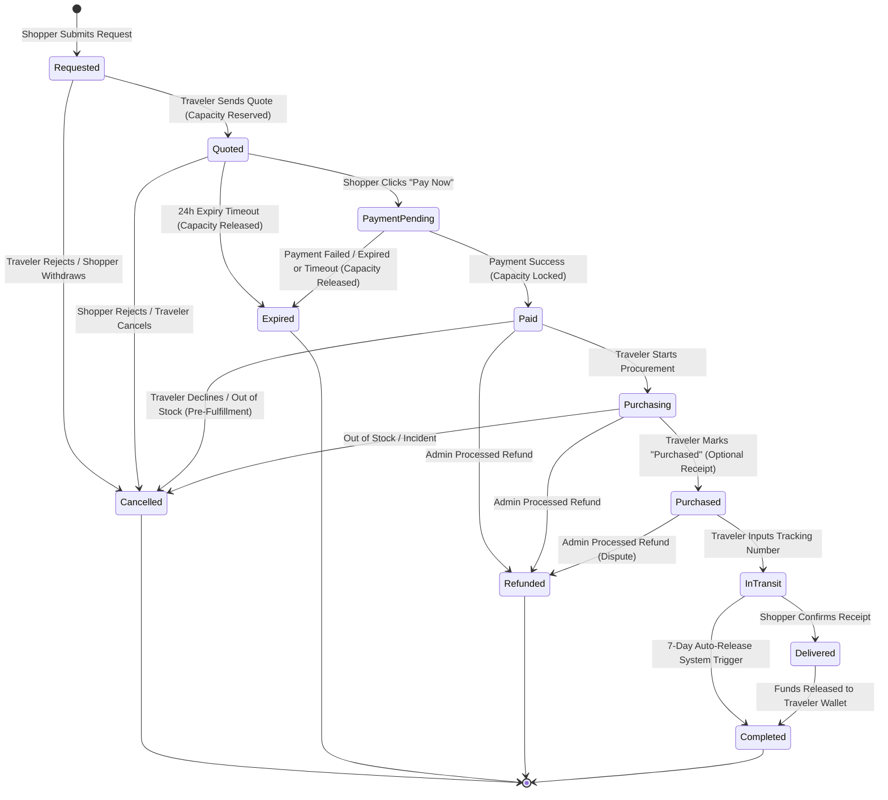

# Order Lifecycle

This document defines the status transitions, system triggers, and baggage capacity operations during the order lifecycle. It is split into two logical stages to guide database design and backend state machine transitions: the **Request Lifecycle** (pre-payment) and the **Fulfillment Lifecycle** (post-payment).

---

## 1. Status Transition Table

The following table maps the state transitions for the MVP order engine:

| Status | Stage | Description | System Trigger | Allowed Next States | Baggage Capacity Action |
| :--- | :--- | :--- | :--- | :--- | :--- |
| **Requested** | Request | Shopper submitted a product request. | Shopper clicks "Submit Request" | `Quoted`, `Cancelled` | None |
| **Quoted** | Request | Traveler has sent a quote. | Traveler sends quote details | `Payment Pending`, `Cancelled`, `Expired` | **Reserve capacity** (Starts 24h timer) |
| **Payment Pending** | Request | Shopper is in the checkout portal. | Shopper clicks "Pay Now" | `Paid`, `Expired` | Keep reserved |
| **Paid** | Fulfillment | Payment is confirmed. Escrow is funded. | Gateway webhook (success) | `Purchasing`, `Cancelled`, `Refunded` | **Confirm Lock** (Lock baggage slot) |
| **Purchasing** | Fulfillment | Traveler has started procurement/travel. | Traveler starts procurement | `Purchased`, `Cancelled`, `Refunded` | Locked |
| **Purchased** | Fulfillment | Traveler bought the item abroad. | Traveler marks as Purchased (optional receipt upload) | `In Transit`, `Refunded` | Locked |
| **In Transit** | Fulfillment | Traveler shipped the package domestically. | Traveler inputs tracking AWB | `Delivered`, `Completed` | Locked |
| **Delivered** | Fulfillment | Shopper confirmed package receipt. | Shopper clicks "Confirm Receipt" | `Completed` | Released (Trip completed) |
| **Completed** | Fulfillment | Escrow released to traveler wallet. | Auto-release or manual release | None (Final State) | Released (Trip completed) |
| **Expired** | Request | Quote or payment window closed. | 24-hour expiry timer triggers OR gateway webhook failure | None (Final State) | **Release capacity** (Restore baggage slots) |
| **Cancelled** | Both | Request rejected or manual cancel. | Traveler decline / Admin override | None (Final State) | **Release capacity** / Unlock baggage slots |
| **Refunded** | Exception | Payment returned to shopper. | Admin triggers escrow refund | None (Final State) | **Release capacity** / Unlock baggage slots |

---

## 2. State Transition Diagram

The state transitions are managed strictly by the platform's transaction backend:

---

## 3. Capacity & Expiry Business Rules

1.  **24-Hour Expiry Window / Failed Checkouts**: The transition from `Quoted` or `Payment Pending` to `Expired` is managed by either an automated cron job/timer or an immediate callback from the payment gateway. Once the timer triggers or gateway reports failure/expiry, the order state is updated to `Expired`, and the reserved weight is restored to the traveler's active trip.
2.  **Double Booking Protection**: The system check validates that `trip.available_capacity >= request.estimated_weight` before allowing the traveler to issue a quote.
3.  **Cancellation Post-Payment**: Once an order reaches `Paid` or `Purchasing`, standard cancellations are disabled. In case of extreme events (e.g., traveler cannot find the item, customs confiscation), the case must be escalated to the Admin to trigger a manual `Refunded` or `Cancelled` state, returning the escrow money to the shopper.
