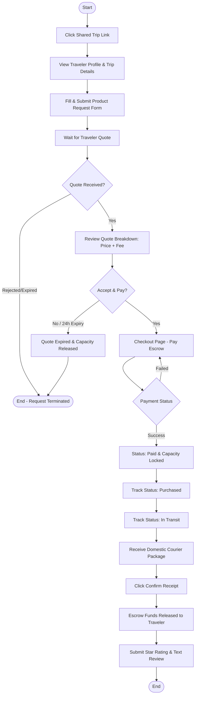

# Shopper Flow

This document details the step-by-step user flow, navigation paths, and user experience considerations for the **Shopper** actor in the My Trip My Titipan MVP.

---

## 1. Step-by-Step Flow

The Shopper flow focuses on discovering traveler capacity and completing transaction security:

*   **Open Shared Link**: The shopper clicks a shared trip link on social media and is redirected to the public trip details page.
*   **View Profile**: The shopper reviews the traveler's profile parameters (star ratings, reviews count, completed orders count, travel history).
*   **Submit Request**: The shopper fills a structured product request form (Item name, URL, photo upload, quantity, budget, weight).
*   **Receive Quote**: The shopper receives a notification that the traveler has quoted the request, displaying the breakdown of cost.
*   **Checkout**: The shopper reviews the total price and proceeds to checkout.
*   **Escrow Payment**: The shopper transfers funds via virtual accounts or e-wallets within 24 hours. The capacity reservation is then locked.
*   **Track Order Status**: The shopper monitors the fulfillment progress (`Paid` → `Purchased` → `In Transit` → `Delivered`) on their dashboard.
*   **Confirm Receipt**: Upon package delivery, the shopper confirms receipt in the app, releasing the escrow.
*   **Leave Review**: The shopper leaves a star rating and text review for the traveler.

---

## 2. Shopper Flow Diagram

---

## 3. Shopper-Specific UX Notes

### Mitigation of Capacity Expiry Confusion
> [!NOTE]
> **Capacity Reservation Expiry**: Shoppers may not understand why a quote is no longer available.
> *   **UX Solution**: Place a clear countdown timer (e.g., "Expires in 14h 23m") on the Quote details page and send a notification warning 2 hours before expiry.
> *   **UX Solution**: Add micro-copy explaining that baggage capacity is limited and cannot be held indefinitely.

### Error States
*   **Baggage Capacity Full**: If a shopper requests an item whose estimated weight exceeds the traveler's remaining capacity, disable the request button. Display: *"Baggage capacity limit reached. This traveler cannot take additional requests."*
*   **Payment Failure**: If the checkout gateway throws an error, keep the user on the checkout page, display the error message clearly, and provide a "Try Again" button alongside the remaining expiry timer.

### Empty States
*   **Empty Shopper Dashboard**: When a shopper has no active requests, display: *"No active titipan. Once you find a traveler's trip link, you can submit product requests here."*
