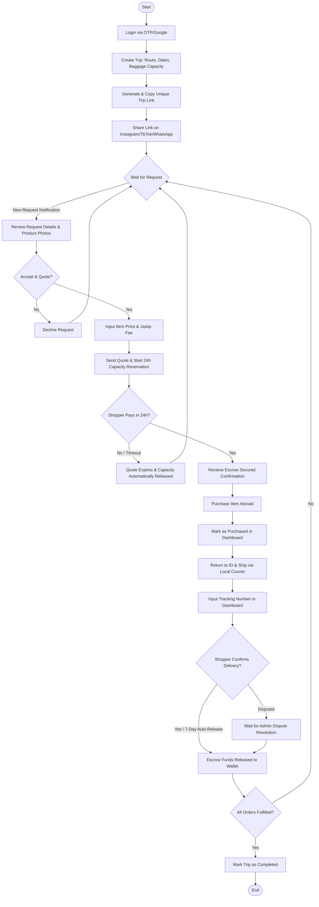

# Traveler Flow

This document details the step-by-step user flow, navigation paths, and user experience considerations for the **Traveler** actor in the My Trip My Titipan MVP.

---

## 1. Step-by-Step Flow

The Traveler flow focuses on creating capacity (trip setup) and fulfilling incoming product requests:

*   **Login**: The traveler logs in via OTP or Google on a mobile-first interface.
*   **Create Trip**: The traveler enters travel parameters: Route (Departure/Arrival airport), Travel Dates (Departure/Arrival), and Baggage Capacity limit (in kg).
*   **Share Link**: The traveler copies the generated unique URL (e.g., `mytrip.com/t/budi-tokyo-24`) and shares it on social media/WhatsApp.
*   **Review Request**: The traveler is notified when a shopper submits a request, reviewing item photos, external URLs, details, quantity, and budget.
*   **Send Quote**: The traveler enters the local purchase price of the item and their desired service fee (Jastip Fee).
*   **Capacity Reservation**: Sending the quote triggers a temporary 24-hour baggage capacity reservation based on the item's estimated weight.
*   **Track Orders**: The traveler views current requests and active orders in the dashboard sorted by state.
*   **Mark Purchased**: The traveler physically purchases the item abroad and updates the status to "Purchased" in the dashboard.
*   **Ship Item**: Once back in Indonesia, the traveler ships the item manually via a domestic courier and inputs the tracking AWB number in the dashboard.
*   **Receive Payout**: The escrow funds are automatically released to the traveler's balance after shopper delivery confirmation (or via the 7-day auto-release timer).
*   **Complete Trip**: Once all orders are completed, the traveler archives the trip.

---

## 2. Traveler Flow Diagram

---

## 3. Traveler-Specific UX Notes

### Mitigation of Traveler Capital Risk Anxiety
> [!IMPORTANT]
> **Out-of-Pocket Purchasing**: Travelers must purchase the items using their own funds first, which can cause anxiety.
> *   **UX Solution**: When displaying "Paid" orders in the Traveler Dashboard, include a prominent green lock badge next to the status stating: *"Escrow Secured: Shopper funds are locked by the platform. You are guaranteed payout upon domestic shipment and receipt."*

### Error States
*   **Invalid Tracking Number**: When a traveler enters shipping details, validate the tracking number format against courier APIs. If invalid, highlight the input field in red with: *"Please enter a valid tracking number."*

### Empty States
*   **Empty Trips Dashboard**: When a traveler has no trips, show a suitcase illustration and a prompt: *"Planning a journey? Publish your trip and share the link to start receiving product requests."* with a primary CTA button: *"Create Trip"*.
*   **Empty Requests Dashboard**: When a traveler has a trip but no requests yet, show a status card: *"No requests yet. Copy your trip link and share it on Instagram or WhatsApp to attract shoppers!"* with a CTA button: *"Copy Trip Link"*.
