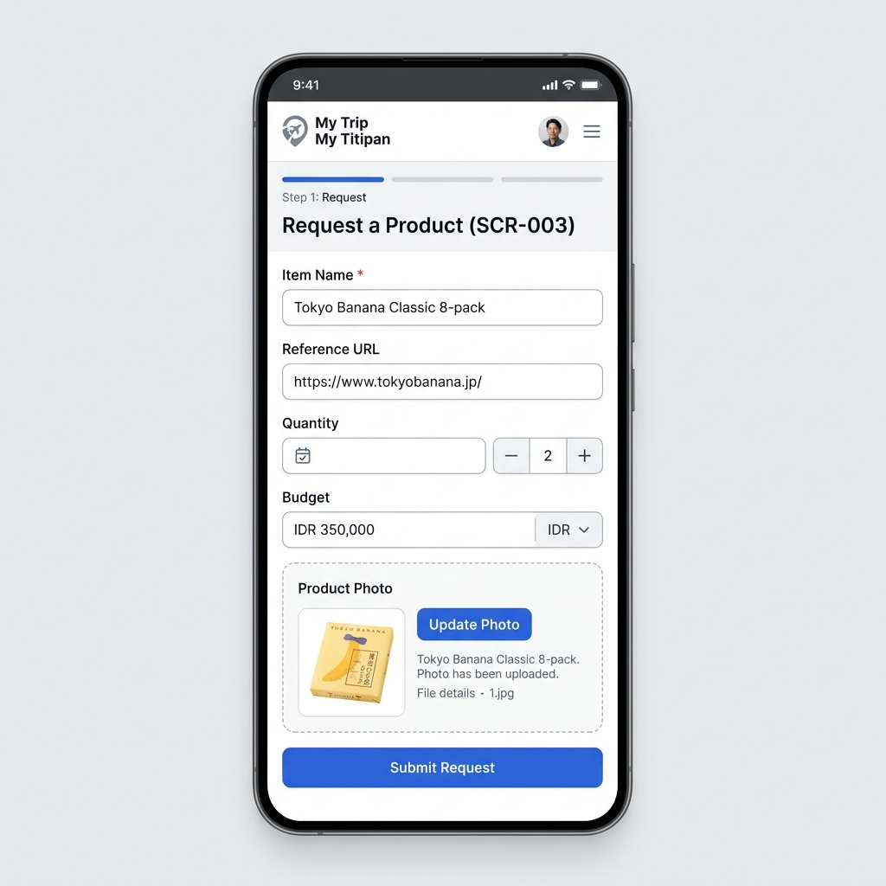

# SCR-003: Product Request Form

> **Status**: 📝 Draft **Last Updated**: 2026-06-14

This screen contains a structured form allowing shoppers to submit detailed request specifications (Name, URL, image, quantity, and budget) to a traveler.

---

## 1. Visual Mockup & ASCII Wireframe Layout



```text
--------------------------------------------------
| [Back]            Request New Item             |
|                                                |
|  Item Details                                  |
|  Item Name *                                   |
|  [ input: Tokyo Banana Classic 8-pack        ] |
|                                                |
|  Reference URL (Optional)                      |
|  [ input: https://tokyobanana.jp/classic     ] |
|                                                |
|  Quantity *                                    |
|  [ - ]  2  [ + ]                               |
|                                                |
|  Willingness to Pay (Budget in IDR) *          |
|  IDR [ input: 350,000                        ] |
|                                                |
|  Product Photo *                               |
|  +------------------------------------------+  |
|  | [Icon: Camera] Upload Photo (Max 5MB)    |  |
|  +------------------------------------------+  |
|                                                |
|  [ Button: Submit Request                    ] |
--------------------------------------------------
```

---

## 2. UI Elements Specification

1. **Back Button (`BTN-003-001`):**
   * *Action:* Returns to `SCR-002: Trip Landing Page`. Unsaved inputs trigger a browser discard confirmation alert.
2. **Item Name Input (`FLD-003-001`):**
   * *Type:* Text field, required. Max 100 characters.
3. **Reference URL Input (`FLD-003-002`):**
   * *Type:* Text field, optional. Must follow standard URL format pattern.
4. **Quantity Stepper Selector (`FLD-003-003`):**
   * *Type:* Numeric counter. Restricts minimum selection to 1.
5. **Willingness to Pay Budget Input (`FLD-003-004`):**
   * *Type:* Currency numeric field, required. Formatted with thousands separator (e.g., `350.000`).
6. **Photo Uploader Box (`FLD-003-005`):**
   * *Type:* Click-to-upload card container.
   * *Validation:* Required. Accepts JPEG, PNG, and WebP, max 5MB. On upload success, a small thumbnail preview is generated.
7. **Submit Request Button (`BTN-003-002`):**
   * *Type:* Primary action button.
   * *Action:* Validates all required inputs. If user is unauthenticated, stores form draft in session storage and redirects to `SCR-001: Login / Register`. Otherwise, submits data.

---

## 3. UI State Variations

### A. Uploading State
* Displays a progress bar (`[=======>    ] 70%`) inside the `FLD-003-005` container card.
* Submit button is temporarily disabled.

### B. Validation Errors
* Fields with invalid inputs (e.g., missing name, invalid URL, blank image) are outlined in red.
* Associated error messages (e.g., `Item name is required`) are displayed immediately below the fields.

---

## 4. Traceability

* **User Story:** [US-003-001](../user-stories/shopper/submit-request.md#us-003-001-submit-product-request)
* **Requirement:** [Product Request Form](../../02-product/requirements/feature-requirements.md#2-product-request-form)
