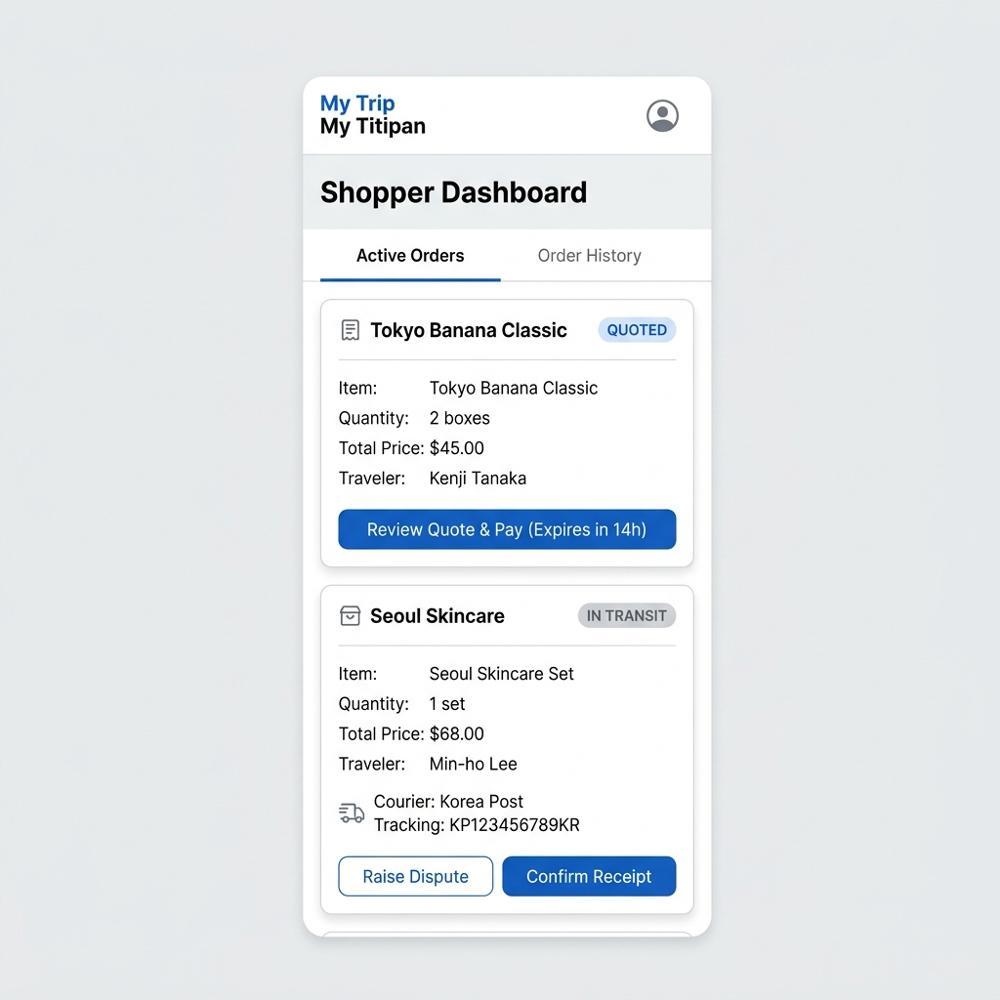

# SCR-004: Shopper Dashboard

> **Status**: 📝 Draft **Last Updated**: 2026-06-14

This is the primary area for authenticated shoppers to track active product requests, monitor courier tracking codes, and access invoices or review buttons.

---

## 1. Visual Mockup & ASCII Wireframe Layout



```text
--------------------------------------------------
| [User Avatar]  Shopper Area    [Logout]         |
|                                                |
|  [ Tab: Active Orders (3) | History (8) ]       |
|                                                |
|  --------------------------------------------  |
|  Tokyo Banana Classic (Qty: 2)                 |
|  Traveler: Budi Santoso                        |
|  Status: QUOTED                                |
|  [ Button: Review Quote & Pay ]  (Expires 14h) |
|  --------------------------------------------  |
|  Seoul Skincare Essence                        |
|  Traveler: Maria                               |
|  Status: IN TRANSIT                            |
|  Courier: JNE | AWB: CGK8810293                |
|  [ Button: Confirm Receipt ] [Raise Dispute]   |
|  --------------------------------------------  |
|  Matcha Green Tea                              |
|  Traveler: Andi                                |
|  Status: DELIVERED                             |
|  [ Button: Leave Review ]                      |
--------------------------------------------------
```

---

## 2. UI Elements Specification

1. **Dashboard Tabs (`TAB-004-001`):**
   * *Active Orders:* Filter displaying order records in non-terminal states (`Requested`, `Quoted`, `Payment Pending`, `Paid`, `Purchasing`, `Purchased`, `In Transit`, `Delivered`).
   * *History:* Filter displaying orders in terminal states (`Completed`, `Expired`, `Cancelled`, `Refunded`).
2. **Order Cards list (`LST-004-001`):**
   * Displays item name, traveler name, status tag, and action triggers.
3. **Review Quote & Pay Button (`BTN-004-001`):**
   * *Type:* Action button on cards in `QUOTED` status.
   * *Action:* Redirects to `SCR-005: Quote & Checkout Page`.
   * *Wording:* Displays countdown timer indicator (e.g., `Review Quote & Pay (Expires in 14h)`).
4. **Confirm Receipt Button (`BTN-004-002`):**
   * *Type:* Action button on cards in `IN_TRANSIT` status.
   * *Action:* Triggers confirmation dialog box. Upon verification, updates order status to `DELIVERED`, initiates wallet payout, and transitions status to `COMPLETED`.
5. **Raise Dispute Button (`BTN-004-003`):**
   * *Type:* Link/Button.
   * *Action:* Redirects to support portal to initiate dispute flow (locks escrow auto-settlement timers).
6. **Leave Review Button (`BTN-004-004`):**
   * *Type:* Action button on cards in `DELIVERED` or `COMPLETED` status.
   * *Action:* Redirects to `SCR-011: Review Submission`.

---

## 3. UI State Variations

### A. Empty State
* If shopper has no active requests: Display a package illustration with text `No active requests found.` and a link to return to active search tips.

### B. Confirmed Payout State
* Payout animations display progress while release transfers are executing, changing buttons to completed indicators.

---

## 4. Traceability

* **User Story:** [US-005-001](../user-stories/traveler/review-request.md#us-005-001-traveler-order-tracking-dashboard), [US-005-002](../user-stories/shopper/confirm-delivery.md#us-005-002-delivery-confirmation--payout-trigger)
* **Requirement:** [Order tracking specs](../../02-product/requirements/feature-requirements.md#8-order-lifecycle-tracking-dashboard)
