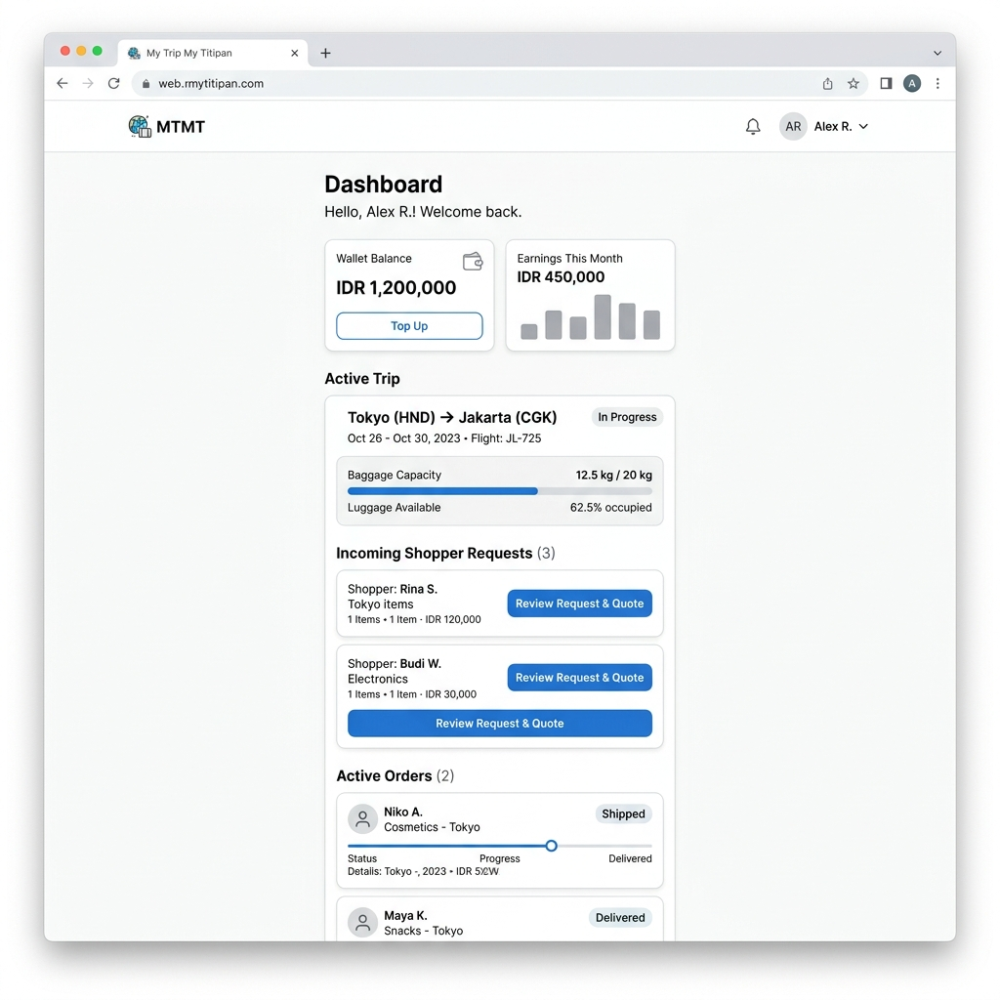

# SCR-006: Traveler Dashboard

> **Status**: 📝 Draft **Last Updated**: 2026-06-14

This screen serves as the primary home area for authenticated travelers to manage their travel schedule lists, review incoming product requests, and monitor wallet balances.

---

## 1. Visual Mockup & ASCII Wireframe Layout



```text
--------------------------------------------------
| [User Avatar]  Traveler Dashboard   [Logout]   |
|  Wallet Payout Balance: IDR 1,200,000          |
|                                                |
|  ----------- Active Trips -----------          |
|  Tokyo -> Jakarta (20 - 28 Jun 2026)           |
|  Capacity: [|||||||||------] 12.5kg/20kg       |
|  [ Button: Create / Publish New Trip ]         |
|                                                |
|  ----------- Incoming Requests -----------     |
|  - Tokyo Banana (Maria)   - Willing: IDR 350k  |
|    [ Button: Review Request & Quote ]          |
|                                                |
|  ----------- Active Orders (Fulfillment) ----- |
|  - Seoul Cosmetics (Andi) - Status: PAID       |
|    [ Button: Open Order Details ]              |
--------------------------------------------------
```

---

## 2. UI Elements Specification

1. **Wallet Balance Indicator (`TXT-006-001`):**
   * Displays the traveler's total finalized revenues available for domestic withdrawal.
2. **Active Trips List (`LST-006-001`):**
   * Lists active journeys showing route, travel schedule, and baggage capacity metrics.
3. **Baggage Capacity Meter (`BAR-006-001`):**
   * Progress indicator illustrating occupancy weights. Integrates available vs reserved/locked slots.
4. **Publish New Trip Button (`BTN-006-001`):**
   * *Type:* Action button.
   * *Action:* Redirects to `SCR-007: Create Trip Form`.
5. **Incoming Requests List (`LST-006-002`):**
   * Lists requests in status `REQUESTED` linked to active trips.
   * *Review Trigger Button:* Redirects to `SCR-009: Request Review Screen`.
6. **Active Orders List (`LST-006-003`):**
   * Lists orders in fulfillment states (`Paid`, `Purchasing`, `Purchased`, `In Transit`).
   * *Details Trigger Button:* Redirects to `SCR-010: Traveler Order Details`.

---

## 3. UI State Variations

### A. Empty Trips State
* If traveler has not published any trip records:
  * Hide lists and display: `No trips published yet. Create a trip to generate a link and receive product requests.`
  * Display a prominent CTA card linking to `SCR-007`.

### B. Empty Requests State
* If no shoppers have requested items:
  * Display: `No incoming product requests yet. Share your trip link to attract shoppers.`

---

## 4. Traceability

* **User Story:** [US-002-001](../user-stories/traveler/create-trip.md#us-002-001-publish-trip), [US-005-001](../user-stories/traveler/review-request.md#us-005-001-traveler-order-tracking-dashboard)
* **Requirement:** [Trip inventory specs](../../02-product/requirements/feature-requirements.md#1-trip-publisher)
