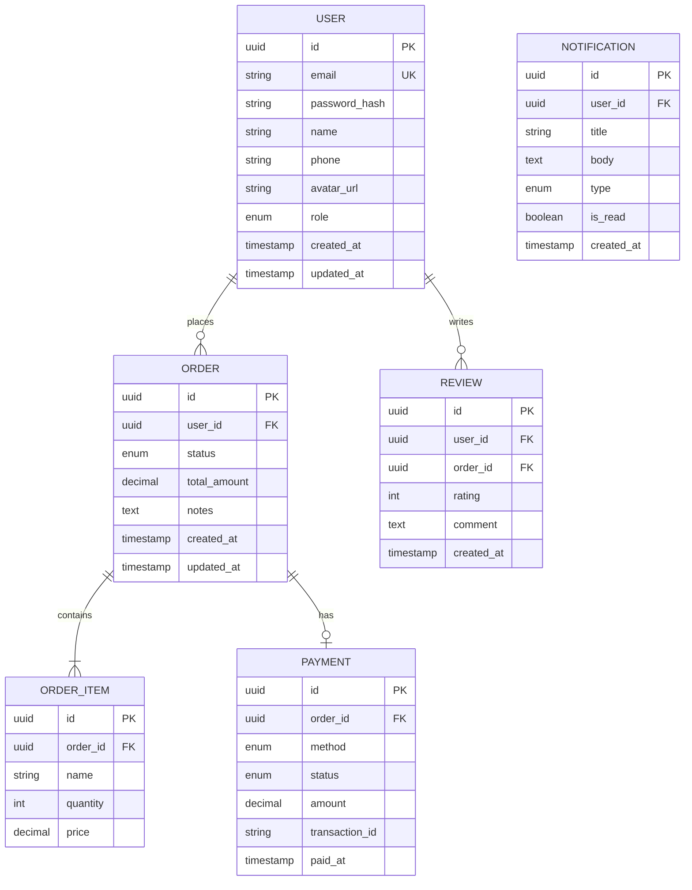

# Database Design

> **Status**: 📝 Draft
> **Last Updated**: YYYY-MM-DD
> **Database**: PostgreSQL

---

## 1. Entity Relationship Diagram



## 2. Table Specifications

### users

| Column | Type | Constraints | Description |
|--------|------|------------|-------------|
| id | UUID | PK, DEFAULT gen_random_uuid() | |
| email | VARCHAR(255) | UNIQUE, NOT NULL | |
| password_hash | VARCHAR(255) | NOT NULL | bcrypt hash |
| name | VARCHAR(100) | NOT NULL | |
| phone | VARCHAR(20) | UNIQUE | |
| avatar_url | TEXT | NULLABLE | |
| role | ENUM | DEFAULT 'user' | user, admin, provider |
| email_verified_at | TIMESTAMP | NULLABLE | |
| created_at | TIMESTAMP | DEFAULT NOW() | |
| updated_at | TIMESTAMP | DEFAULT NOW() | |

### Indexes

```sql
CREATE INDEX idx_users_email ON users(email);
CREATE INDEX idx_users_role ON users(role);
CREATE INDEX idx_orders_user_id ON orders(user_id);
CREATE INDEX idx_orders_status ON orders(status);
CREATE INDEX idx_orders_created_at ON orders(created_at);
```

## 3. Migration Strategy

| Version | Description | Status |
|---------|-------------|--------|
| 001 | Create users table | ⬜ |
| 002 | Create orders & order_items tables | ⬜ |
| 003 | Create payments table | ⬜ |
| 004 | Create reviews table | ⬜ |
| 005 | Create notifications table | ⬜ |

## 4. Data Policies

| Policy | Detail |
|--------|--------|
| Backup | Daily automated, 30-day retention |
| Encryption | AES-256 at rest, TLS in transit |
| PII Handling | Hashed passwords, encrypted sensitive data |
| Retention | User data deleted 30 days after account deletion |
| Soft Delete | All tables use `deleted_at` column |

---

> **Input dari**: [System Architecture](system-architecture.md), [PRD](../02-product/prd.md)
> **Output ke**: [API Specification](api-specification/), Backend implementation
