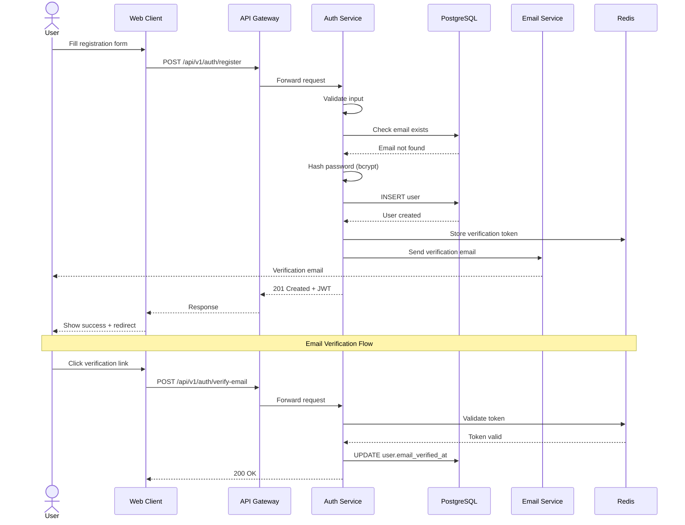
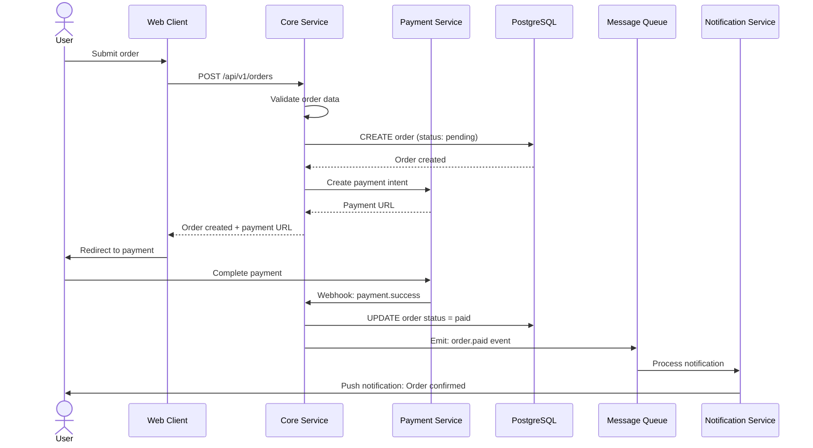

# Sequence Diagrams

> Diagram urutan interaksi antar komponen sistem.

## Diagrams Index

| Diagram | Description | Status |
|---------|-------------|--------|
| User Registration | Alur registrasi user baru | 📝 Draft |
| User Login | Alur autentikasi | ⬜ Todo |
| Place Order | Alur pembuatan order | ⬜ Todo |
| Payment Processing | Alur pembayaran | ⬜ Todo |
| Notification Delivery | Alur pengiriman notifikasi | ⬜ Todo |

## Example: User Registration

## Example: Place Order

---

> **Input dari**: [Use Cases](../../02-product/use-cases/), [System Architecture](../system-architecture.md)
> **Output ke**: Backend implementation
